# Benchmark Results for model ESN

## Global Performance Summary

|       | Model   | Task                        |   Accuracy |      MSE |   Precision |   Recall |        BIC |   Training Time (s) |   Inference Time (s) |   Memory Usage (MB) | Task Args                                                                                          | Model Args                                                                                 | Training Args   |   Number Params |
|------:|:--------|:----------------------------|-----------:|---------:|------------:|---------:|-----------:|--------------------:|---------------------:|--------------------:|:---------------------------------------------------------------------------------------------------|:-------------------------------------------------------------------------------------------|:----------------|----------------:|
| 21755 | ESN     | adding_problem              |     0.02   | nan      |      0.0687 |   0.02   | 129215     |              9.4116 |               2.2087 |            -26.3477 | {'n_samples': 1000, 'sequence_length': 100, 'max_number': 20}                                      | {'n_units': 320, 'spectral_radius': 0.26834271902780615, 'leak_rate': 0.5358112124320743}  | {}              |           23495 |
|  7834 | ESN     | bracket_matching            |     0.825  | nan      |      0.8259 |   0.825  |   1277.2   |             10.5467 |               3.6064 |              0.0195 | {'n_samples': 1000, 'sequence_length': 200, 'max_depth': 20}                                       | {'n_units': 39, 'spectral_radius': 0.7001172938730246, 'leak_rate': 0.30989906509610465}   | {}              |             208 |
| 11880 | ESN     | chaotic_forecasting         |   nan      |  40.5081 |    nan      | nan      |   1182.55  |              3.0035 |               0.0183 |              0.0352 | {'sequence_length': 1000, 'forecast_length': 10}                                                   | {'n_units': 9, 'spectral_radius': 0.04186674974875759, 'leak_rate': 0.27898647303020463}   | {}              |              42 |
|  5408 | ESN     | continue_pattern_completion |   nan      |   0.0147 |    nan      | nan      | -36496.7   |             17.349  |               1.9283 |             -7.6484 | {'n_samples': 1000, 'sequence_length': 100, 'base_length': 10, 'mask_ratio': 0.2}                  | {'n_units': 214, 'spectral_radius': 0.9231682569367188, 'leak_rate': 0.6166924751555354}   | {}              |            4837 |
| 14889 | ESN     | continue_postcasting        |   nan      |   0.0085 |    nan      | nan      |   8365.5   |              1.2237 |               0.019  |              0.1055 | {'sequence_length': 1000, 'delay': 10}                                                             | {'n_units': 127, 'spectral_radius': 0.9103199910102436, 'leak_rate': 0.966667847799392}    | {}              |            1767 |
| 16368 | ESN     | copy_task                   |     0.0004 | nan      |      0.0451 |   0.0004 |  80735.5   |             11.4915 |               2.0104 |             45.2188 | {'n_samples': 1000, 'sequence_length': 50, 'delay': 10, 'n_symbols': 10}                           | {'n_units': 95, 'spectral_radius': 0.9009441672042262, 'leak_rate': 0.034603416697605915}  | {}              |            1976 |
|  3304 | ESN     | discrete_pattern_completion |     0.8    | nan      |      1      |   0.8    |  38002     |             15.0764 |               1.7756 |             11.7031 | {'n_samples': 1000, 'sequence_length': 100, 'n_symbols': 12, 'base_length': 20, 'mask_ratio': 0.2} | {'n_units': 50, 'spectral_radius': 0.29033286481293763, 'leak_rate': 0.9214481190837358}   | {}              |             932 |
| 13753 | ESN     | discrete_postcasting        |     0.0421 | nan      |      0.0935 |   0.0579 |  37368.7   |              1.0609 |               0.0224 |              0.0078 | {'sequence_length': 1000, 'delay': 10, 'n_symbols': 30}                                            | {'n_units': 138, 'spectral_radius': 0.9454287754835786, 'leak_rate': 0.15404521188160403}  | {}              |            6502 |
|  1847 | ESN     | mnist_classification        |     0.64   | nan      |      0.8824 |   0.66   |  18660.7   |              2.6836 |               0.5736 |              0      | {'n_samples': 1000, 'path': 'datasets/mnist'}                                                      | {'n_units': 130, 'spectral_radius': 0.31459263773382995, 'leak_rate': 0.10225341024042178} | {}              |            3390 |
| 18094 | ESN     | selective_copy_task         |     0.0012 | nan      |      0.0302 |   0.0012 |  40612.9   |              9.6044 |               2.3603 |            -45.0703 | {'n_samples': 1000, 'sequence_length': 100, 'delay': 10, 'n_markers': 20, 'n_symbols': 10}         | {'n_units': 89, 'spectral_radius': 0.8199218248350508, 'leak_rate': 0.017866017551226077}  | {}              |            1808 |
|  8969 | ESN     | sin_forecasting             |   nan      |   0.0112 |    nan      | nan      |   -649.013 |              2.3897 |               0.0182 |              0.0352 | {'sequence_length': 1000, 'forecast_length': 10}                                                   | {'n_units': 16, 'spectral_radius': 0.2717934175915394, 'leak_rate': 0.6372521132989128}    | {}              |              47 |
| 23630 | ESN     | sorting_problem             |     0.0014 | nan      |      0.2054 |   0.0015 | 215811     |             16.0583 |               2.1569 |             28.5391 | {'n_samples': 1000, 'sequence_length': 50, 'n_symbols': 10}                                        | {'n_units': 328, 'spectral_radius': 0.07465390687361761, 'leak_rate': 0.6283160476697883}  | {}              |           16082 |

## Task: adding_problem
#### Results
- Accuracy: 0.0200
- Precision: 0.0687
- Recall: 0.0200
- Training Time: 9.4116 seconds
- Inference Time: 2.2087 seconds
- Memory Usage: -26.3477 MB
- Number Params: 23495

#### Task Parameters
{'n_samples': 1000, 'sequence_length': 100, 'max_number': 20}

#### Model Parameters
{'n_units': 320, 'spectral_radius': 0.26834271902780615, 'leak_rate': 0.5358112124320743}

#### Training Parameters
{}

#### Performance Plot
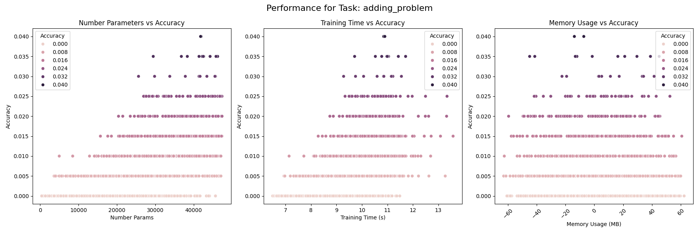

## Task: bracket_matching
#### Results
- Accuracy: 0.8250
- Precision: 0.8259
- Recall: 0.8250
- Training Time: 10.5467 seconds
- Inference Time: 3.6064 seconds
- Memory Usage: 0.0195 MB
- Number Params: 208

#### Task Parameters
{'n_samples': 1000, 'sequence_length': 200, 'max_depth': 20}

#### Model Parameters
{'n_units': 39, 'spectral_radius': 0.7001172938730246, 'leak_rate': 0.30989906509610465}

#### Training Parameters
{}

#### Performance Plot
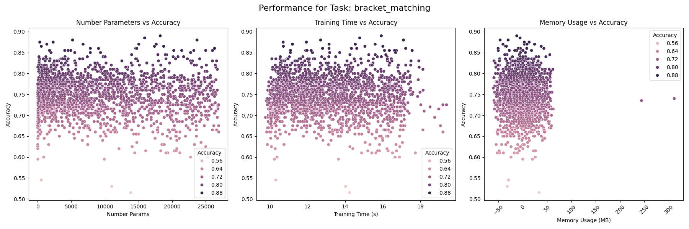

## Task: chaotic_forecasting
#### Results
- MSE: 40.5081
- Training Time: 3.0035 seconds
- Inference Time: 0.0183 seconds
- Memory Usage: 0.0352 MB
- Number Params: 42

#### Task Parameters
{'sequence_length': 1000, 'forecast_length': 10}

#### Model Parameters
{'n_units': 9, 'spectral_radius': 0.04186674974875759, 'leak_rate': 0.27898647303020463}

#### Training Parameters
{}

#### Performance Plot
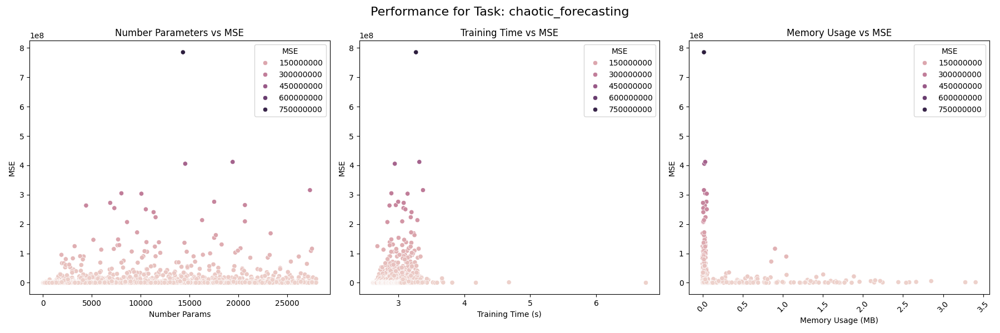

## Task: continue_pattern_completion
#### Results
- MSE: 0.0147
- Training Time: 17.3490 seconds
- Inference Time: 1.9283 seconds
- Memory Usage: -7.6484 MB
- Number Params: 4837

#### Task Parameters
{'n_samples': 1000, 'sequence_length': 100, 'base_length': 10, 'mask_ratio': 0.2}

#### Model Parameters
{'n_units': 214, 'spectral_radius': 0.9231682569367188, 'leak_rate': 0.6166924751555354}

#### Training Parameters
{}

#### Performance Plot
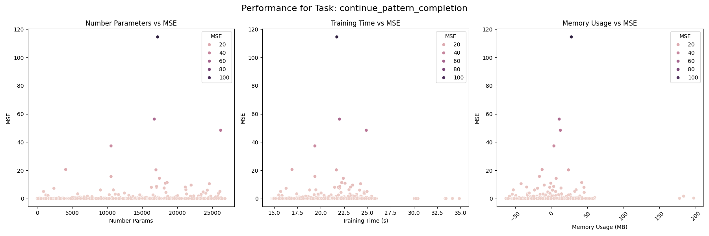

## Task: continue_postcasting
#### Results
- MSE: 0.0085
- Training Time: 1.2237 seconds
- Inference Time: 0.0190 seconds
- Memory Usage: 0.1055 MB
- Number Params: 1767

#### Task Parameters
{'sequence_length': 1000, 'delay': 10}

#### Model Parameters
{'n_units': 127, 'spectral_radius': 0.9103199910102436, 'leak_rate': 0.966667847799392}

#### Training Parameters
{}

#### Performance Plot
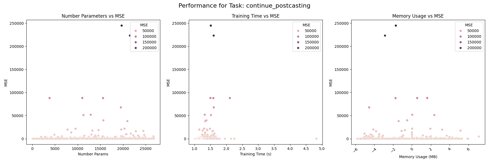

## Task: copy_task
#### Results
- Accuracy: 0.0004
- Precision: 0.0451
- Recall: 0.0004
- Training Time: 11.4915 seconds
- Inference Time: 2.0104 seconds
- Memory Usage: 45.2188 MB
- Number Params: 1976

#### Task Parameters
{'n_samples': 1000, 'sequence_length': 50, 'delay': 10, 'n_symbols': 10}

#### Model Parameters
{'n_units': 95, 'spectral_radius': 0.9009441672042262, 'leak_rate': 0.034603416697605915}

#### Training Parameters
{}

#### Performance Plot
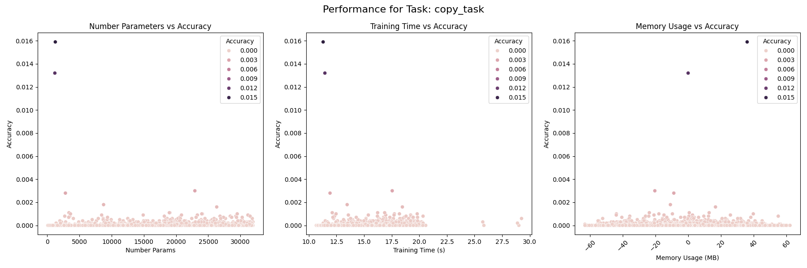

## Task: discrete_pattern_completion
#### Results
- Accuracy: 0.8000
- Precision: 1.0000
- Recall: 0.8000
- Training Time: 15.0764 seconds
- Inference Time: 1.7756 seconds
- Memory Usage: 11.7031 MB
- Number Params: 932

#### Task Parameters
{'n_samples': 1000, 'sequence_length': 100, 'n_symbols': 12, 'base_length': 20, 'mask_ratio': 0.2}

#### Model Parameters
{'n_units': 50, 'spectral_radius': 0.29033286481293763, 'leak_rate': 0.9214481190837358}

#### Training Parameters
{}

#### Performance Plot
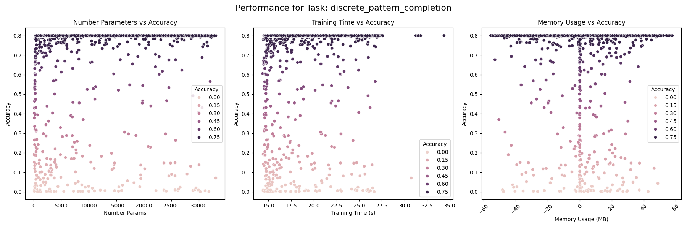

## Task: discrete_postcasting
#### Results
- Accuracy: 0.0421
- Precision: 0.0935
- Recall: 0.0579
- Training Time: 1.0609 seconds
- Inference Time: 0.0224 seconds
- Memory Usage: 0.0078 MB
- Number Params: 6502

#### Task Parameters
{'sequence_length': 1000, 'delay': 10, 'n_symbols': 30}

#### Model Parameters
{'n_units': 138, 'spectral_radius': 0.9454287754835786, 'leak_rate': 0.15404521188160403}

#### Training Parameters
{}

#### Performance Plot
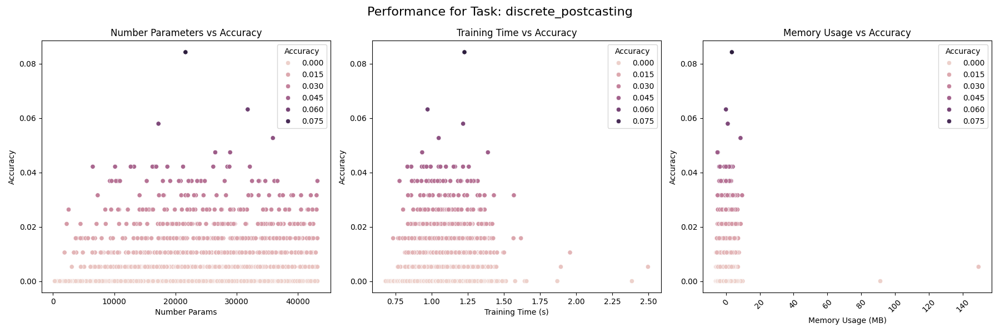

## Task: mnist_classification
#### Results
- Accuracy: 0.6400
- Precision: 0.8824
- Recall: 0.6600
- Training Time: 2.6836 seconds
- Inference Time: 0.5736 seconds
- Memory Usage: 0.0000 MB
- Number Params: 3390

#### Task Parameters
{'n_samples': 1000, 'path': 'datasets/mnist'}

#### Model Parameters
{'n_units': 130, 'spectral_radius': 0.31459263773382995, 'leak_rate': 0.10225341024042178}

#### Training Parameters
{}

#### Performance Plot
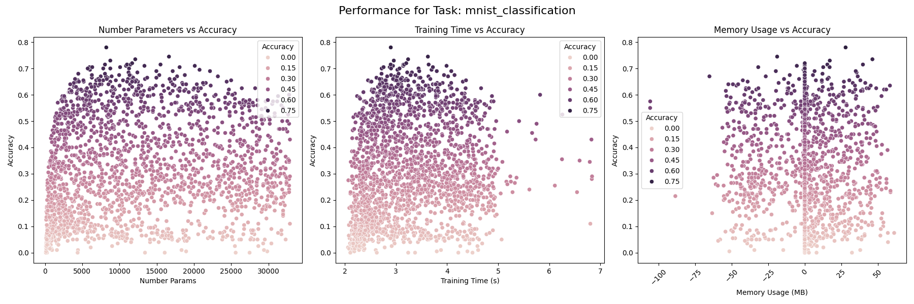

## Task: selective_copy_task
#### Results
- Accuracy: 0.0013
- Precision: 0.0302
- Recall: 0.0013
- Training Time: 9.6044 seconds
- Inference Time: 2.3603 seconds
- Memory Usage: -45.0703 MB
- Number Params: 1808

#### Task Parameters
{'n_samples': 1000, 'sequence_length': 100, 'delay': 10, 'n_markers': 20, 'n_symbols': 10}

#### Model Parameters
{'n_units': 89, 'spectral_radius': 0.8199218248350508, 'leak_rate': 0.017866017551226077}

#### Training Parameters
{}

#### Performance Plot
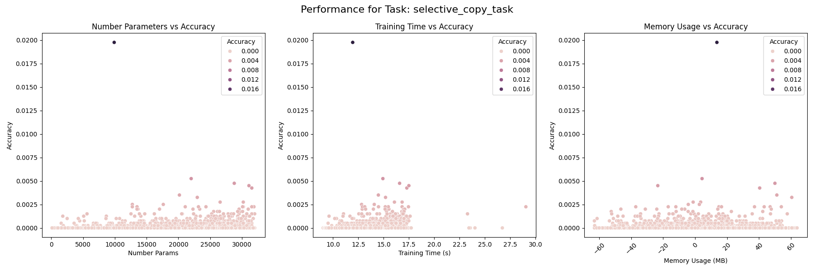

## Task: sin_forecasting
#### Results
- MSE: 0.0112
- Training Time: 2.3897 seconds
- Inference Time: 0.0182 seconds
- Memory Usage: 0.0352 MB
- Number Params: 47

#### Task Parameters
{'sequence_length': 1000, 'forecast_length': 10}

#### Model Parameters
{'n_units': 16, 'spectral_radius': 0.2717934175915394, 'leak_rate': 0.6372521132989128}

#### Training Parameters
{}

#### Performance Plot
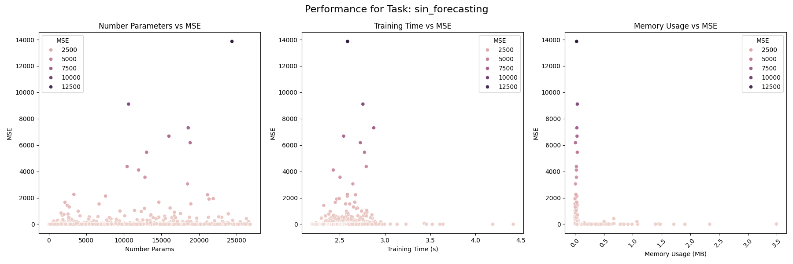

## Task: sorting_problem
#### Results
- Accuracy: 0.0014
- Precision: 0.2054
- Recall: 0.0015
- Training Time: 16.0583 seconds
- Inference Time: 2.1569 seconds
- Memory Usage: 28.5391 MB
- Number Params: 16082

#### Task Parameters
{'n_samples': 1000, 'sequence_length': 50, 'n_symbols': 10}

#### Model Parameters
{'n_units': 328, 'spectral_radius': 0.07465390687361761, 'leak_rate': 0.6283160476697883}

#### Training Parameters
{}

#### Performance Plot
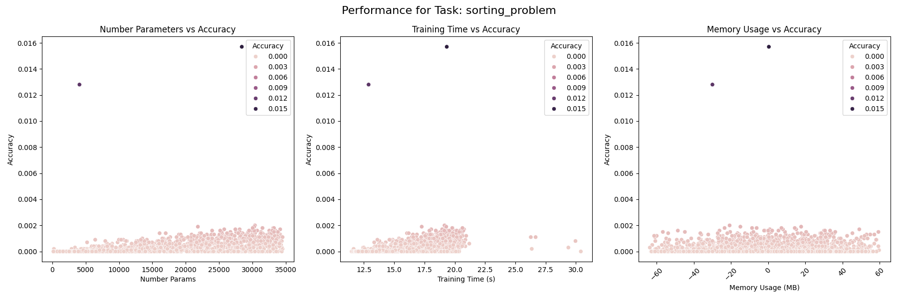

