# Benchmark Results for model LSTM

## Global Performance Summary

|       | Model   | Task                        |   Accuracy |      MSE |   Precision |   Recall |              BIC |   Training Time (s) |   Inference Time (s) |   Memory Usage (MB) | Task Args                                                                                          | Model Args                                                                      | Training Args                    |   Number Params |
|------:|:--------|:----------------------------|-----------:|---------:|------------:|---------:|-----------------:|--------------------:|---------------------:|--------------------:|:---------------------------------------------------------------------------------------------------|:--------------------------------------------------------------------------------|:---------------------------------|----------------:|
| 17331 | LSTM    | adding_problem              |     0      | nan      |      0      |   0      |  37462.2         |              4.7166 |               0.0013 |                   0 | {'n_samples': 1000, 'sequence_length': 100, 'max_number': 20}                                      | {'hidden_size': 10, 'num_layers': 6, 'learning_rate': 0.001, 'device': 'cuda'}  | {'epochs': 10, 'batch_size': 10} |            6189 |
| 23214 | LSTM    | bracket_matching            |     0.57   | nan      |      0.3249 |   0.57   |  14179.6         |              4.7326 |               0.001  |                   0 | {'n_samples': 1000, 'sequence_length': 200, 'max_depth': 20}                                       | {'hidden_size': 8, 'num_layers': 4, 'learning_rate': 0.001, 'device': 'cuda'}   | {'epochs': 10, 'batch_size': 10} |            2153 |
| 11004 | LSTM    | chaotic_forecasting         |   nan      | 161.39   |    nan      | nan      | 856242           |              1.6588 |               0.0022 |                   0 | {'sequence_length': 1000, 'forecast_length': 10}                                                   | {'hidden_size': 198, 'num_layers': 1, 'learning_rate': 0.001, 'device': 'cuda'} | {'epochs': 10, 'batch_size': 10} |          161373 |
|  2691 | LSTM    | continue_pattern_completion |   nan      |   0.0024 |    nan      | nan      |      1.91515e+06 |             11.2045 |               0.0308 |                   0 | {'n_samples': 1000, 'sequence_length': 100, 'base_length': 10, 'mask_ratio': 0.2}                  | {'hidden_size': 130, 'num_layers': 2, 'learning_rate': 0.001, 'device': 'cuda'} | {'epochs': 10, 'batch_size': 10} |          205531 |
|  6942 | LSTM    | continue_postcasting        |   nan      |   0.1051 |    nan      | nan      |      3.20284e+06 |              3.5711 |               0.0051 |                   0 | {'sequence_length': 1000, 'delay': 10}                                                             | {'hidden_size': 147, 'num_layers': 4, 'learning_rate': 0.001, 'device': 'cuda'} | {'epochs': 10, 'batch_size': 10} |          610492 |
| 13018 | LSTM    | copy_task                   |     0.1083 | nan      |      0.1004 |   0.2042 | 300185           |              5.3883 |               0.0013 |                   0 | {'n_samples': 1000, 'sequence_length': 50, 'delay': 10, 'n_symbols': 10}                           | {'hidden_size': 8, 'num_layers': 9, 'learning_rate': 0.001, 'device': 'cuda'}   | {'epochs': 10, 'batch_size': 10} |            5370 |
|  1492 | LSTM    | discrete_pattern_completion |     0.7898 | nan      |      0.4468 |   0.951  |      1.79757e+06 |              3.9557 |               0.0389 |                   0 | {'n_samples': 1000, 'sequence_length': 100, 'n_symbols': 12, 'base_length': 20, 'mask_ratio': 0.2} | {'hidden_size': 102, 'num_layers': 2, 'learning_rate': 0.001, 'device': 'cuda'} | {'epochs': 10, 'batch_size': 10} |          133020 |
|  4151 | LSTM    | discrete_postcasting        |     0.0053 | nan      |      0.0029 |   0.0053 |  14241.1         |              0.2556 |               0.0007 |                   0 | {'sequence_length': 1000, 'delay': 10, 'n_symbols': 30}                                            | {'hidden_size': 9, 'num_layers': 1, 'learning_rate': 0.001, 'device': 'cuda'}   | {'epochs': 10, 'batch_size': 10} |            1776 |
| 21281 | LSTM    | mnist_classification        |     0      | nan      |      0      |   0      |  36435.2         |              4.3514 |               0.0006 |                   0 | {'n_samples': 1000, 'path': 'datasets/mnist'}                                                      | {'hidden_size': 11, 'num_layers': 5, 'learning_rate': 0.001, 'device': 'cuda'}  | {'epochs': 10, 'batch_size': 10} |            6192 |
| 15399 | LSTM    | selective_copy_task         |     0.1003 | nan      |      0.0101 |   0.1003 | 143438           |              6.4734 |               0.058  |                   0 | {'n_samples': 1000, 'sequence_length': 100, 'delay': 10, 'n_markers': 20, 'n_symbols': 10}         | {'hidden_size': 8, 'num_layers': 10, 'learning_rate': 0.001, 'device': 'cuda'}  | {'epochs': 10, 'batch_size': 10} |            5978 |
|  9449 | LSTM    | sin_forecasting             |   nan      |   0.0244 |    nan      | nan      | 610773           |              0.4757 |               0.2139 |                   0 | {'sequence_length': 1000, 'forecast_length': 10}                                                   | {'hidden_size': 56, 'num_layers': 5, 'learning_rate': 0.001, 'device': 'cuda'}  | {'epochs': 10, 'batch_size': 10} |          115417 |
| 19776 | LSTM    | sorting_problem             |     0.0971 | nan      |      0.0379 |   0.0976 | 300714           |              5.5668 |               0.0019 |                   0 | {'n_samples': 1000, 'sequence_length': 50, 'n_symbols': 10}                                        | {'hidden_size': 8, 'num_layers': 10, 'learning_rate': 0.001, 'device': 'cuda'}  | {'epochs': 10, 'batch_size': 10} |            7546 |

## Task: adding_problem
#### Results
- Accuracy: 0.0000
- Precision: 0.0000
- Recall: 0.0000
- Training Time: 4.7166 seconds
- Inference Time: 0.0013 seconds
- Memory Usage: 0.0000 MB
- Number Params: 6189

#### Task Parameters
{'n_samples': 1000, 'sequence_length': 100, 'max_number': 20}

#### Model Parameters
{'hidden_size': 10, 'num_layers': 6, 'learning_rate': 0.001, 'device': 'cuda'}

#### Training Parameters
{'epochs': 10, 'batch_size': 10}

#### Performance Plot
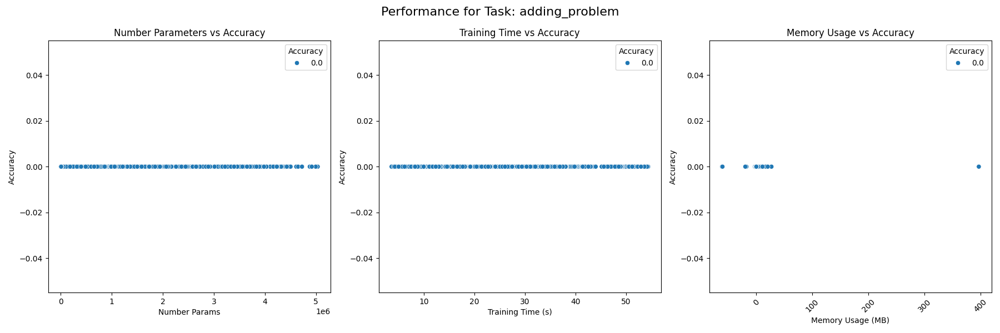

## Task: bracket_matching
#### Results
- Accuracy: 0.5700
- Precision: 0.3249
- Recall: 0.5700
- Training Time: 4.7326 seconds
- Inference Time: 0.0010 seconds
- Memory Usage: 0.0000 MB
- Number Params: 2153

#### Task Parameters
{'n_samples': 1000, 'sequence_length': 200, 'max_depth': 20}

#### Model Parameters
{'hidden_size': 8, 'num_layers': 4, 'learning_rate': 0.001, 'device': 'cuda'}

#### Training Parameters
{'epochs': 10, 'batch_size': 10}

#### Performance Plot
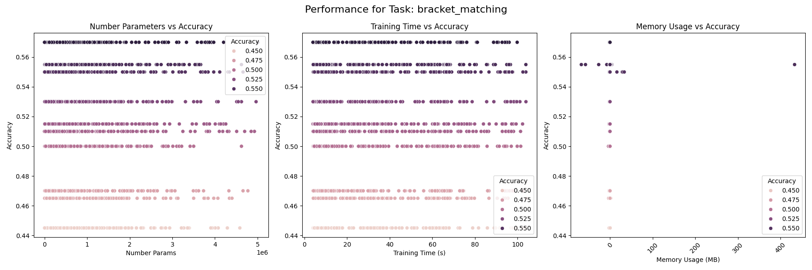

## Task: chaotic_forecasting
#### Results
- MSE: 161.3904
- Training Time: 1.6588 seconds
- Inference Time: 0.0022 seconds
- Memory Usage: 0.0000 MB
- Number Params: 161373

#### Task Parameters
{'sequence_length': 1000, 'forecast_length': 10}

#### Model Parameters
{'hidden_size': 198, 'num_layers': 1, 'learning_rate': 0.001, 'device': 'cuda'}

#### Training Parameters
{'epochs': 10, 'batch_size': 10}

#### Performance Plot
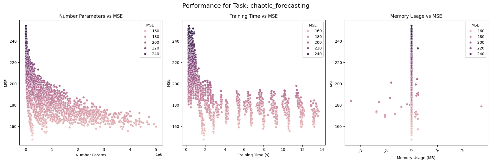

## Task: continue_pattern_completion
#### Results
- MSE: 0.0024
- Training Time: 11.2045 seconds
- Inference Time: 0.0308 seconds
- Memory Usage: 0.0000 MB
- Number Params: 205531

#### Task Parameters
{'n_samples': 1000, 'sequence_length': 100, 'base_length': 10, 'mask_ratio': 0.2}

#### Model Parameters
{'hidden_size': 130, 'num_layers': 2, 'learning_rate': 0.001, 'device': 'cuda'}

#### Training Parameters
{'epochs': 10, 'batch_size': 10}

#### Performance Plot
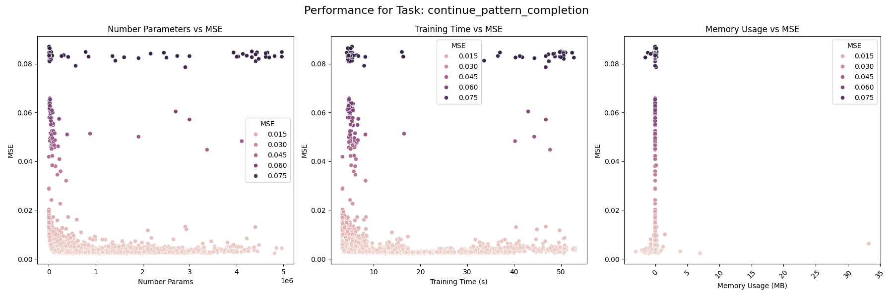

## Task: continue_postcasting
#### Results
- MSE: 0.1051
- Training Time: 3.5711 seconds
- Inference Time: 0.0051 seconds
- Memory Usage: 0.0000 MB
- Number Params: 610492

#### Task Parameters
{'sequence_length': 1000, 'delay': 10}

#### Model Parameters
{'hidden_size': 147, 'num_layers': 4, 'learning_rate': 0.001, 'device': 'cuda'}

#### Training Parameters
{'epochs': 10, 'batch_size': 10}

#### Performance Plot
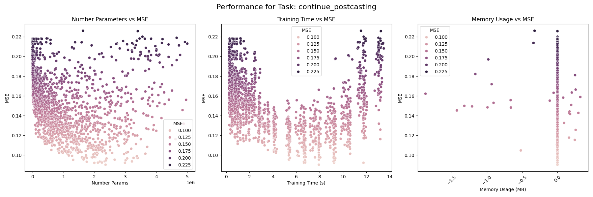

## Task: copy_task
#### Results
- Accuracy: 0.1083
- Precision: 0.1004
- Recall: 0.2042
- Training Time: 5.3883 seconds
- Inference Time: 0.0013 seconds
- Memory Usage: 0.0000 MB
- Number Params: 5370

#### Task Parameters
{'n_samples': 1000, 'sequence_length': 50, 'delay': 10, 'n_symbols': 10}

#### Model Parameters
{'hidden_size': 8, 'num_layers': 9, 'learning_rate': 0.001, 'device': 'cuda'}

#### Training Parameters
{'epochs': 10, 'batch_size': 10}

#### Performance Plot
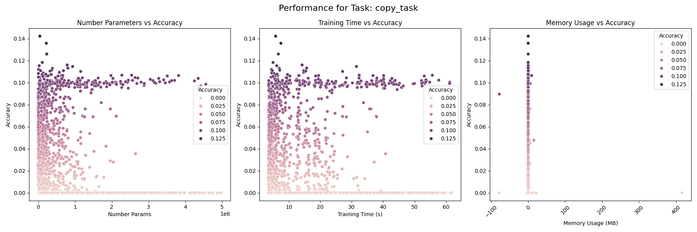

## Task: discrete_pattern_completion
#### Results
- Accuracy: 0.7898
- Precision: 0.4468
- Recall: 0.9510
- Training Time: 3.9557 seconds
- Inference Time: 0.0389 seconds
- Memory Usage: 0.0000 MB
- Number Params: 133020

#### Task Parameters
{'n_samples': 1000, 'sequence_length': 100, 'n_symbols': 12, 'base_length': 20, 'mask_ratio': 0.2}

#### Model Parameters
{'hidden_size': 102, 'num_layers': 2, 'learning_rate': 0.001, 'device': 'cuda'}

#### Training Parameters
{'epochs': 10, 'batch_size': 10}

#### Performance Plot
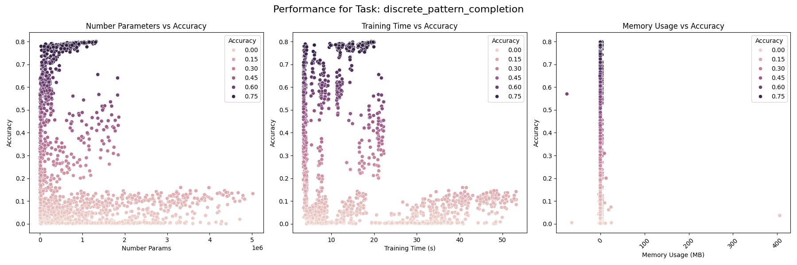

## Task: discrete_postcasting
#### Results
- Accuracy: 0.0053
- Precision: 0.0029
- Recall: 0.0053
- Training Time: 0.2556 seconds
- Inference Time: 0.0007 seconds
- Memory Usage: 0.0000 MB
- Number Params: 1776

#### Task Parameters
{'sequence_length': 1000, 'delay': 10, 'n_symbols': 30}

#### Model Parameters
{'hidden_size': 9, 'num_layers': 1, 'learning_rate': 0.001, 'device': 'cuda'}

#### Training Parameters
{'epochs': 10, 'batch_size': 10}

#### Performance Plot
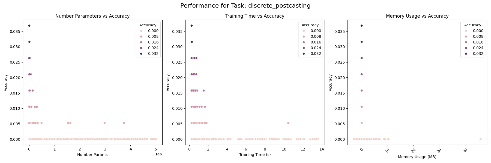

## Task: mnist_classification
#### Results
- Accuracy: 0.0000
- Precision: 0.0000
- Recall: 0.0000
- Training Time: 4.3514 seconds
- Inference Time: 0.0006 seconds
- Memory Usage: 0.0000 MB
- Number Params: 6192

#### Task Parameters
{'n_samples': 1000, 'path': 'datasets/mnist'}

#### Model Parameters
{'hidden_size': 11, 'num_layers': 5, 'learning_rate': 0.001, 'device': 'cuda'}

#### Training Parameters
{'epochs': 10, 'batch_size': 10}

#### Performance Plot
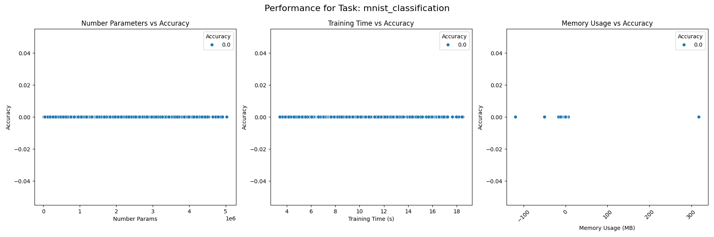

## Task: selective_copy_task
#### Results
- Accuracy: 0.1003
- Precision: 0.0101
- Recall: 0.1003
- Training Time: 6.4734 seconds
- Inference Time: 0.0580 seconds
- Memory Usage: 0.0000 MB
- Number Params: 5978

#### Task Parameters
{'n_samples': 1000, 'sequence_length': 100, 'delay': 10, 'n_markers': 20, 'n_symbols': 10}

#### Model Parameters
{'hidden_size': 8, 'num_layers': 10, 'learning_rate': 0.001, 'device': 'cuda'}

#### Training Parameters
{'epochs': 10, 'batch_size': 10}

#### Performance Plot
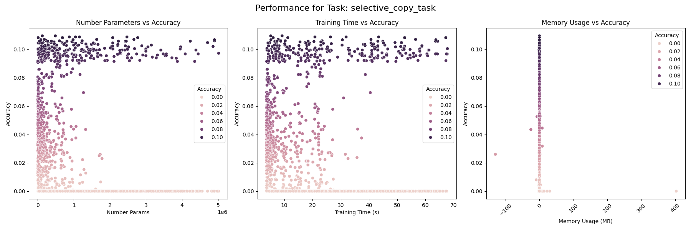

## Task: sin_forecasting
#### Results
- MSE: 0.0244
- Training Time: 0.4757 seconds
- Inference Time: 0.2139 seconds
- Memory Usage: 0.0000 MB
- Number Params: 115417

#### Task Parameters
{'sequence_length': 1000, 'forecast_length': 10}

#### Model Parameters
{'hidden_size': 56, 'num_layers': 5, 'learning_rate': 0.001, 'device': 'cuda'}

#### Training Parameters
{'epochs': 10, 'batch_size': 10}

#### Performance Plot
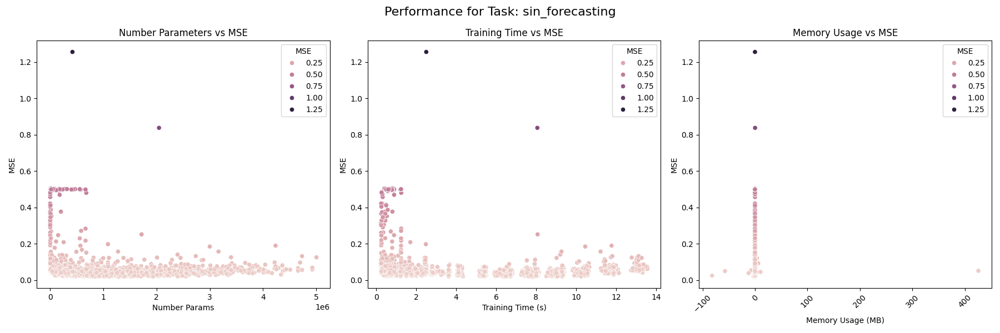

## Task: sorting_problem
#### Results
- Accuracy: 0.0971
- Precision: 0.0379
- Recall: 0.0976
- Training Time: 5.5668 seconds
- Inference Time: 0.0019 seconds
- Memory Usage: 0.0000 MB
- Number Params: 7546

#### Task Parameters
{'n_samples': 1000, 'sequence_length': 50, 'n_symbols': 10}

#### Model Parameters
{'hidden_size': 8, 'num_layers': 10, 'learning_rate': 0.001, 'device': 'cuda'}

#### Training Parameters
{'epochs': 10, 'batch_size': 10}

#### Performance Plot
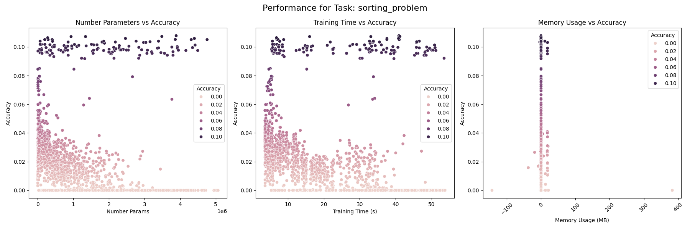

