# Benchmark Results for model TransformerDecoderOnly

## Global Performance Summary

|       | Model                  | Task                        |   Accuracy |      MSE |   Precision |   Recall |              BIC |   Training Time (s) |   Inference Time (s) |   Memory Usage (MB) | Task Args                                                                                          | Model Args                                                                                                                     | Training Args                    |   Number Params |
|------:|:-----------------------|:----------------------------|-----------:|---------:|------------:|---------:|-----------------:|--------------------:|---------------------:|--------------------:|:---------------------------------------------------------------------------------------------------|:-------------------------------------------------------------------------------------------------------------------------------|:---------------------------------|----------------:|
|  1333 | TransformerDecoderOnly | adding_problem              |     0      | nan      |      0.0032 |   0.105  |  55105.7         |              1.0755 |               0.0028 |              0      | {'n_samples': 1000, 'sequence_length': 100, 'max_number': 20}                                      | {'d_model': 16, 'nhead': 8, 'num_layers': 2, 'dim_feedforward': 64, 'dropout': 0.1, 'learning_rate': 0.001, 'device': 'cuda'}  | {'epochs': 10, 'batch_size': 10} |            7591 |
|  5321 | TransformerDecoderOnly | bracket_matching            |     0.57   | nan      |      0.3249 |   0.57   |  18080.5         |              0.6085 |               0.0024 |              0      | {'n_samples': 1000, 'sequence_length': 200, 'max_depth': 20}                                       | {'d_model': 16, 'nhead': 4, 'num_layers': 1, 'dim_feedforward': 64, 'dropout': 0.1, 'learning_rate': 0.001, 'device': 'cuda'}  | {'epochs': 10, 'batch_size': 10} |            3361 |
| 15965 | TransformerDecoderOnly | chaotic_forecasting         |   nan      | 191.74   |    nan      | nan      | 358351           |              0.0403 |               0.0013 |              2.4766 | {'sequence_length': 1000, 'forecast_length': 10}                                                   | {'d_model': 64, 'nhead': 4, 'num_layers': 2, 'dim_feedforward': 128, 'dropout': 0.1, 'learning_rate': 0.001, 'device': 'cuda'} | {'epochs': 10, 'batch_size': 10} |           67395 |
| 18283 | TransformerDecoderOnly | continue_pattern_completion |   nan      |   0.0152 |    nan      | nan      |  46644.3         |              1.5881 |               0.0021 |              0      | {'n_samples': 1000, 'sequence_length': 100, 'base_length': 10, 'mask_ratio': 0.2}                  | {'d_model': 16, 'nhead': 2, 'num_layers': 4, 'dim_feedforward': 64, 'dropout': 0.1, 'learning_rate': 0.001, 'device': 'cuda'}  | {'epochs': 10, 'batch_size': 10} |           13169 |
| 10375 | TransformerDecoderOnly | continue_postcasting        |   nan      |   0.2021 |    nan      | nan      |  17163.6         |              0.0303 |               0.0011 |             -0.5586 | {'sequence_length': 1000, 'delay': 10}                                                             | {'d_model': 16, 'nhead': 8, 'num_layers': 1, 'dim_feedforward': 64, 'dropout': 0.1, 'learning_rate': 0.001, 'device': 'cuda'}  | {'epochs': 10, 'batch_size': 10} |            3329 |
| 20889 | TransformerDecoderOnly | copy_task                   |     0.1041 | nan      |      0.0108 |   0.1041 | 260997           |              0.6103 |               0.0018 |              0      | {'n_samples': 1000, 'sequence_length': 50, 'delay': 10, 'n_symbols': 10}                           | {'d_model': 32, 'nhead': 8, 'num_layers': 1, 'dim_feedforward': 64, 'dropout': 0.1, 'learning_rate': 0.001, 'device': 'cuda'}  | {'epochs': 10, 'batch_size': 10} |            9258 |
| 16554 | TransformerDecoderOnly | discrete_pattern_completion |     0.8    | nan      |      0.313  |   1      |      1.49591e+06 |              0.5989 |               0.0017 |              0      | {'n_samples': 1000, 'sequence_length': 100, 'n_symbols': 12, 'base_length': 20, 'mask_ratio': 0.2} | {'d_model': 32, 'nhead': 8, 'num_layers': 1, 'dim_feedforward': 64, 'dropout': 0.1, 'learning_rate': 0.001, 'device': 'cuda'}  | {'epochs': 10, 'batch_size': 10} |            9388 |
|  8557 | TransformerDecoderOnly | discrete_postcasting        |     0.0105 | nan      |      0.0136 |   0.1158 |  30380.1         |              0.0276 |               0.0017 |              9.1172 | {'sequence_length': 1000, 'delay': 10, 'n_symbols': 30}                                            | {'d_model': 16, 'nhead': 4, 'num_layers': 1, 'dim_feedforward': 64, 'dropout': 0.1, 'learning_rate': 0.001, 'device': 'cuda'}  | {'epochs': 10, 'batch_size': 10} |            4286 |
|  7917 | TransformerDecoderOnly | mnist_classification        |     0.09   | nan      |      0.0594 |   0.15   |  25435.5         |              0.6413 |               0.0009 |              0      | {'n_samples': 1000, 'path': 'datasets/mnist'}                                                      | {'d_model': 16, 'nhead': 8, 'num_layers': 1, 'dim_feedforward': 64, 'dropout': 0.1, 'learning_rate': 0.001, 'device': 'cuda'}  | {'epochs': 10, 'batch_size': 10} |            3930 |
| 22150 | TransformerDecoderOnly | selective_copy_task         |     0.1088 | nan      |      0.0118 |   0.1088 | 131302           |              0.664  |               0.0025 |              0      | {'n_samples': 1000, 'sequence_length': 100, 'delay': 10, 'n_markers': 20, 'n_symbols': 10}         | {'d_model': 16, 'nhead': 8, 'num_layers': 1, 'dim_feedforward': 64, 'dropout': 0.1, 'learning_rate': 0.001, 'device': 'cuda'}  | {'epochs': 10, 'batch_size': 10} |            3658 |
| 12524 | TransformerDecoderOnly | sin_forecasting             |   nan      |   0.03   |    nan      | nan      |  16937.1         |              0.0262 |               0.001  |              0      | {'sequence_length': 1000, 'forecast_length': 10}                                                   | {'d_model': 16, 'nhead': 2, 'num_layers': 1, 'dim_feedforward': 64, 'dropout': 0.1, 'learning_rate': 0.001, 'device': 'cuda'}  | {'epochs': 10, 'batch_size': 10} |            3329 |
|  2094 | TransformerDecoderOnly | sorting_problem             |     0.1078 | nan      |      0.0116 |   0.1078 | 311511           |              0.9792 |               0.0023 |              0      | {'n_samples': 1000, 'sequence_length': 50, 'n_symbols': 10}                                        | {'d_model': 16, 'nhead': 4, 'num_layers': 2, 'dim_feedforward': 64, 'dropout': 0.1, 'learning_rate': 0.001, 'device': 'cuda'}  | {'epochs': 10, 'batch_size': 10} |            7722 |

## Task: adding_problem
#### Results
- Accuracy: 0.0000
- Precision: 0.0032
- Recall: 0.1050
- Training Time: 1.0755 seconds
- Inference Time: 0.0028 seconds
- Memory Usage: 0.0000 MB
- Number Params: 7591

#### Task Parameters
{'n_samples': 1000, 'sequence_length': 100, 'max_number': 20}

#### Model Parameters
{'d_model': 16, 'nhead': 8, 'num_layers': 2, 'dim_feedforward': 64, 'dropout': 0.1, 'learning_rate': 0.001, 'device': 'cuda'}

#### Training Parameters
{'epochs': 10, 'batch_size': 10}

#### Performance Plot
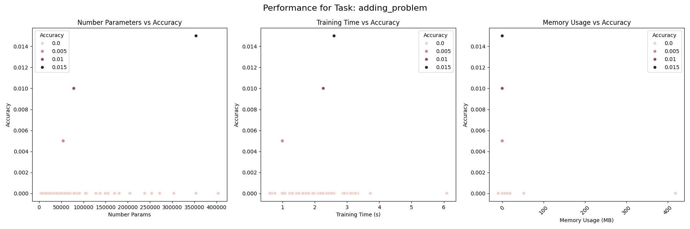

## Task: bracket_matching
#### Results
- Accuracy: 0.5700
- Precision: 0.3249
- Recall: 0.5700
- Training Time: 0.6085 seconds
- Inference Time: 0.0024 seconds
- Memory Usage: 0.0000 MB
- Number Params: 3361

#### Task Parameters
{'n_samples': 1000, 'sequence_length': 200, 'max_depth': 20}

#### Model Parameters
{'d_model': 16, 'nhead': 4, 'num_layers': 1, 'dim_feedforward': 64, 'dropout': 0.1, 'learning_rate': 0.001, 'device': 'cuda'}

#### Training Parameters
{'epochs': 10, 'batch_size': 10}

#### Performance Plot
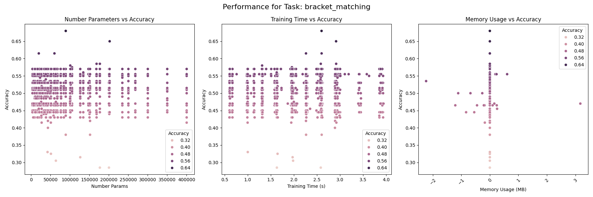

## Task: chaotic_forecasting
#### Results
- MSE: 191.7405
- Training Time: 0.0403 seconds
- Inference Time: 0.0013 seconds
- Memory Usage: 2.4766 MB
- Number Params: 67395

#### Task Parameters
{'sequence_length': 1000, 'forecast_length': 10}

#### Model Parameters
{'d_model': 64, 'nhead': 4, 'num_layers': 2, 'dim_feedforward': 128, 'dropout': 0.1, 'learning_rate': 0.001, 'device': 'cuda'}

#### Training Parameters
{'epochs': 10, 'batch_size': 10}

#### Performance Plot
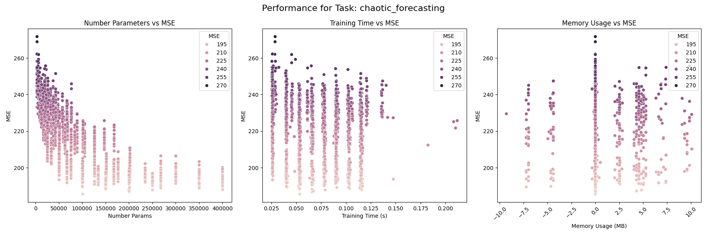

## Task: continue_pattern_completion
#### Results
- MSE: 0.0152
- Training Time: 1.5881 seconds
- Inference Time: 0.0021 seconds
- Memory Usage: 0.0000 MB
- Number Params: 13169

#### Task Parameters
{'n_samples': 1000, 'sequence_length': 100, 'base_length': 10, 'mask_ratio': 0.2}

#### Model Parameters
{'d_model': 16, 'nhead': 2, 'num_layers': 4, 'dim_feedforward': 64, 'dropout': 0.1, 'learning_rate': 0.001, 'device': 'cuda'}

#### Training Parameters
{'epochs': 10, 'batch_size': 10}

#### Performance Plot
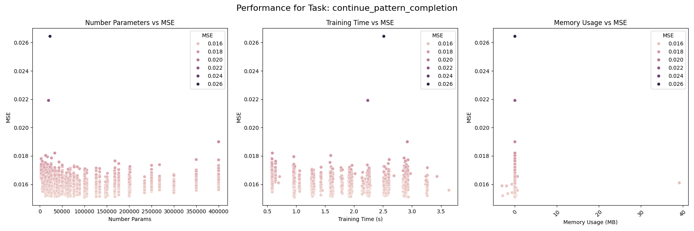

## Task: continue_postcasting
#### Results
- MSE: 0.2021
- Training Time: 0.0303 seconds
- Inference Time: 0.0011 seconds
- Memory Usage: -0.5586 MB
- Number Params: 3329

#### Task Parameters
{'sequence_length': 1000, 'delay': 10}

#### Model Parameters
{'d_model': 16, 'nhead': 8, 'num_layers': 1, 'dim_feedforward': 64, 'dropout': 0.1, 'learning_rate': 0.001, 'device': 'cuda'}

#### Training Parameters
{'epochs': 10, 'batch_size': 10}

#### Performance Plot
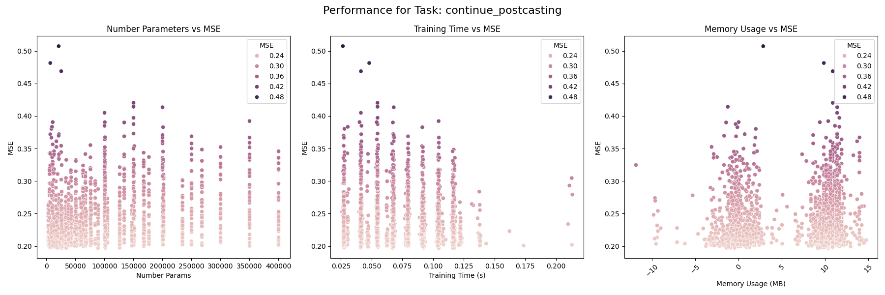

## Task: copy_task
#### Results
- Accuracy: 0.1041
- Precision: 0.0108
- Recall: 0.1041
- Training Time: 0.6103 seconds
- Inference Time: 0.0018 seconds
- Memory Usage: 0.0000 MB
- Number Params: 9258

#### Task Parameters
{'n_samples': 1000, 'sequence_length': 50, 'delay': 10, 'n_symbols': 10}

#### Model Parameters
{'d_model': 32, 'nhead': 8, 'num_layers': 1, 'dim_feedforward': 64, 'dropout': 0.1, 'learning_rate': 0.001, 'device': 'cuda'}

#### Training Parameters
{'epochs': 10, 'batch_size': 10}

#### Performance Plot
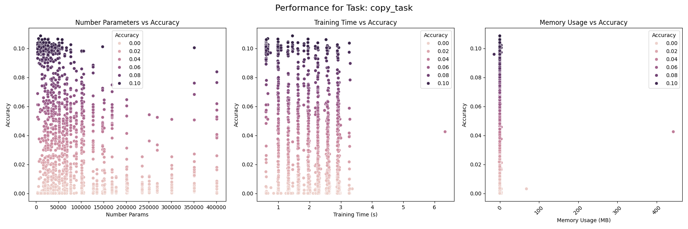

## Task: discrete_pattern_completion
#### Results
- Accuracy: 0.8000
- Precision: 0.3130
- Recall: 1.0000
- Training Time: 0.5989 seconds
- Inference Time: 0.0017 seconds
- Memory Usage: 0.0000 MB
- Number Params: 9388

#### Task Parameters
{'n_samples': 1000, 'sequence_length': 100, 'n_symbols': 12, 'base_length': 20, 'mask_ratio': 0.2}

#### Model Parameters
{'d_model': 32, 'nhead': 8, 'num_layers': 1, 'dim_feedforward': 64, 'dropout': 0.1, 'learning_rate': 0.001, 'device': 'cuda'}

#### Training Parameters
{'epochs': 10, 'batch_size': 10}

#### Performance Plot
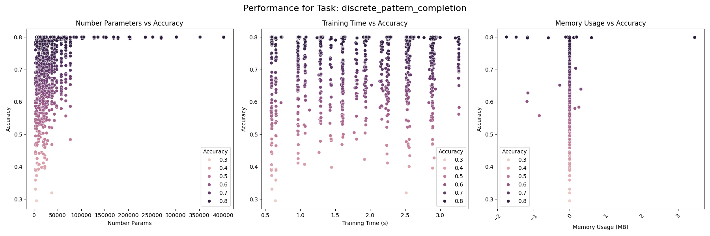

## Task: discrete_postcasting
#### Results
- Accuracy: 0.0105
- Precision: 0.0136
- Recall: 0.1158
- Training Time: 0.0276 seconds
- Inference Time: 0.0017 seconds
- Memory Usage: 9.1172 MB
- Number Params: 4286

#### Task Parameters
{'sequence_length': 1000, 'delay': 10, 'n_symbols': 30}

#### Model Parameters
{'d_model': 16, 'nhead': 4, 'num_layers': 1, 'dim_feedforward': 64, 'dropout': 0.1, 'learning_rate': 0.001, 'device': 'cuda'}

#### Training Parameters
{'epochs': 10, 'batch_size': 10}

#### Performance Plot
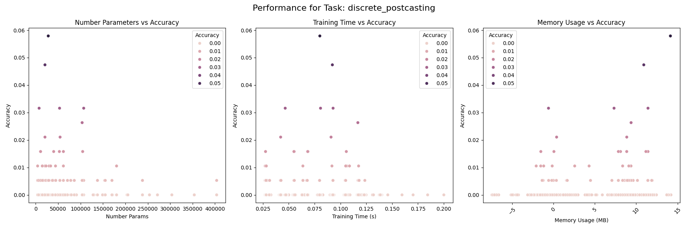

## Task: mnist_classification
#### Results
- Accuracy: 0.0900
- Precision: 0.0594
- Recall: 0.1500
- Training Time: 0.6413 seconds
- Inference Time: 0.0009 seconds
- Memory Usage: 0.0000 MB
- Number Params: 3930

#### Task Parameters
{'n_samples': 1000, 'path': 'datasets/mnist'}

#### Model Parameters
{'d_model': 16, 'nhead': 8, 'num_layers': 1, 'dim_feedforward': 64, 'dropout': 0.1, 'learning_rate': 0.001, 'device': 'cuda'}

#### Training Parameters
{'epochs': 10, 'batch_size': 10}

#### Performance Plot
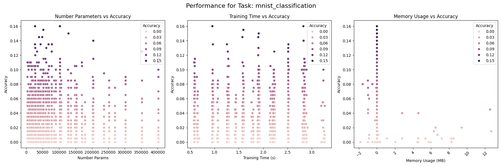

## Task: selective_copy_task
#### Results
- Accuracy: 0.1087
- Precision: 0.0118
- Recall: 0.1087
- Training Time: 0.6640 seconds
- Inference Time: 0.0025 seconds
- Memory Usage: 0.0000 MB
- Number Params: 3658

#### Task Parameters
{'n_samples': 1000, 'sequence_length': 100, 'delay': 10, 'n_markers': 20, 'n_symbols': 10}

#### Model Parameters
{'d_model': 16, 'nhead': 8, 'num_layers': 1, 'dim_feedforward': 64, 'dropout': 0.1, 'learning_rate': 0.001, 'device': 'cuda'}

#### Training Parameters
{'epochs': 10, 'batch_size': 10}

#### Performance Plot
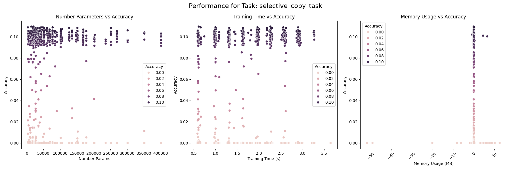

## Task: sin_forecasting
#### Results
- MSE: 0.0300
- Training Time: 0.0262 seconds
- Inference Time: 0.0010 seconds
- Memory Usage: 0.0000 MB
- Number Params: 3329

#### Task Parameters
{'sequence_length': 1000, 'forecast_length': 10}

#### Model Parameters
{'d_model': 16, 'nhead': 2, 'num_layers': 1, 'dim_feedforward': 64, 'dropout': 0.1, 'learning_rate': 0.001, 'device': 'cuda'}

#### Training Parameters
{'epochs': 10, 'batch_size': 10}

#### Performance Plot
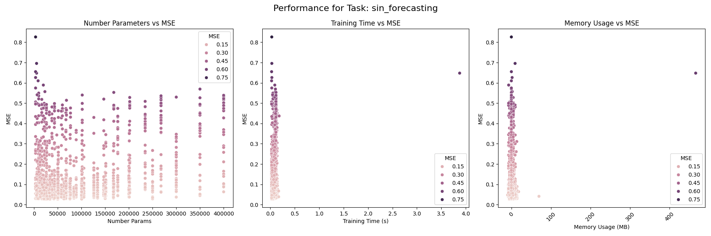

## Task: sorting_problem
#### Results
- Accuracy: 0.1078
- Precision: 0.0116
- Recall: 0.1078
- Training Time: 0.9792 seconds
- Inference Time: 0.0023 seconds
- Memory Usage: 0.0000 MB
- Number Params: 7722

#### Task Parameters
{'n_samples': 1000, 'sequence_length': 50, 'n_symbols': 10}

#### Model Parameters
{'d_model': 16, 'nhead': 4, 'num_layers': 2, 'dim_feedforward': 64, 'dropout': 0.1, 'learning_rate': 0.001, 'device': 'cuda'}

#### Training Parameters
{'epochs': 10, 'batch_size': 10}

#### Performance Plot
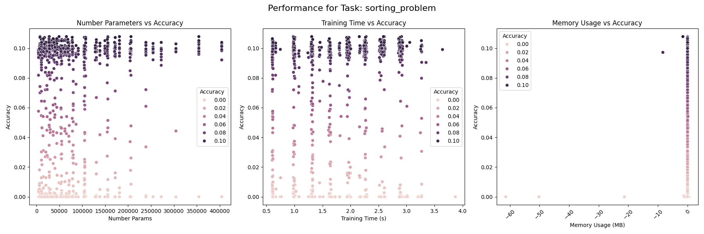

