# Benchmark Results for model Transformers

## Global Performance Summary

|       | Model        | Task                        |   Accuracy |      MSE |   Precision |   Recall |      BIC |   Training Time (s) |   Inference Time (s) |   Memory Usage (MB) | Task Args                                                                                          | Model Args                                                                                                                                                                                    | Training Args                    |   Number Params |
|------:|:-------------|:----------------------------|-----------:|---------:|------------:|---------:|---------:|--------------------:|---------------------:|--------------------:|:---------------------------------------------------------------------------------------------------|:----------------------------------------------------------------------------------------------------------------------------------------------------------------------------------------------|:---------------------------------|----------------:|
| 17316 | Transformers | adding_problem              |     0      | nan      |      0.0103 |   0.21   |  81332.5 |              3.0151 |               0.9877 |                   0 | {'n_samples': 1000, 'sequence_length': 100, 'max_number': 20}                                      | {'d_model': np.int64(16), 'nhead': np.int64(4), 'num_encoder_layers': 1, 'num_decoder_layers': 1, 'dim_feedforward': np.int64(128), 'dropout': 0.1, 'learning_rate': 0.001, 'device': 'cuda'} | {'epochs': 10, 'batch_size': 10} |           13639 |
| 23299 | Transformers | bracket_matching            |     0.57   | nan      |      0.3249 |   0.57   |  59290.2 |              3.3003 |               2.3633 |                   0 | {'n_samples': 1000, 'sequence_length': 200, 'max_depth': 20}                                       | {'d_model': np.int64(16), 'nhead': np.int64(2), 'num_encoder_layers': 2, 'num_decoder_layers': 1, 'dim_feedforward': np.int64(64), 'dropout': 0.1, 'learning_rate': 0.001, 'device': 'cuda'}  | {'epochs': 10, 'batch_size': 10} |           11137 |
| 11023 | Transformers | chaotic_forecasting         |   nan      |   0.1287 |    nan      | nan      |  63554.7 |              0.0676 |               0.2394 |                   0 | {'sequence_length': 1000, 'forecast_length': 10}                                                   | {'d_model': np.int64(16), 'nhead': np.int64(4), 'num_encoder_layers': 1, 'num_decoder_layers': 1, 'dim_feedforward': np.int64(128), 'dropout': 0.1, 'learning_rate': 0.001, 'device': 'cuda'} | {'epochs': 10, 'batch_size': 10} |           12147 |
|  2673 | Transformers | continue_pattern_completion |   nan      |   0.0853 |    nan      | nan      | 419327   |              8.4061 |               5.0397 |                   0 | {'n_samples': 1000, 'sequence_length': 100, 'base_length': 10, 'mask_ratio': 0.2}                  | {'d_model': np.int64(16), 'nhead': np.int64(4), 'num_encoder_layers': 5, 'num_decoder_layers': 8, 'dim_feedforward': np.int64(64), 'dropout': 0.1, 'learning_rate': 0.001, 'device': 'cuda'}  | {'epochs': 10, 'batch_size': 10} |           51745 |
|  7992 | Transformers | continue_postcasting        |   nan      |   0.2002 |    nan      | nan      |  57962.6 |              0.081  |               0.3001 |                   0 | {'sequence_length': 1000, 'delay': 10}                                                             | {'d_model': np.int64(16), 'nhead': np.int64(2), 'num_encoder_layers': 2, 'num_decoder_layers': 1, 'dim_feedforward': np.int64(64), 'dropout': 0.1, 'learning_rate': 0.001, 'device': 'cuda'}  | {'epochs': 10, 'batch_size': 10} |           11105 |
| 12414 | Transformers | copy_task                   |     0.0286 | nan      |      0.0697 |   0.1871 | 602363   |              2.95   |               1.0363 |                   0 | {'n_samples': 1000, 'sequence_length': 50, 'delay': 10, 'n_symbols': 10}                           | {'d_model': np.int64(16), 'nhead': np.int64(2), 'num_encoder_layers': 1, 'num_decoder_layers': 1, 'dim_feedforward': np.int64(128), 'dropout': 0.1, 'learning_rate': 0.001, 'device': 'cuda'} | {'epochs': 10, 'batch_size': 10} |           12506 |
|   216 | Transformers | discrete_pattern_completion |     0.0215 | nan      |      0.0695 |   0.191  | 283887   |              2.957  |               0.9512 |                   0 | {'n_samples': 1000, 'sequence_length': 100, 'n_symbols': 12, 'base_length': 20, 'mask_ratio': 0.2} | {'d_model': np.int64(16), 'nhead': np.int64(2), 'num_encoder_layers': 1, 'num_decoder_layers': 1, 'dim_feedforward': np.int64(128), 'dropout': 0.1, 'learning_rate': 0.001, 'device': 'cuda'} | {'epochs': 10, 'batch_size': 10} |           12604 |
|  5282 | Transformers | discrete_postcasting        |     0      | nan      |      0.0027 |   0.1    |  61934.3 |              0.0679 |               0.2401 |                   0 | {'sequence_length': 1000, 'delay': 10, 'n_symbols': 30}                                            | {'d_model': np.int64(16), 'nhead': np.int64(4), 'num_encoder_layers': 1, 'num_decoder_layers': 1, 'dim_feedforward': np.int64(64), 'dropout': 0.1, 'learning_rate': 0.001, 'device': 'cuda'}  | {'epochs': 10, 'batch_size': 10} |            9246 |
| 20784 | Transformers | mnist_classification        |     0.13   | nan      |      0.0189 |   0.13   |  51011.5 |              2.9241 |               0.2832 |                   0 | {'n_samples': 1000, 'path': 'datasets/mnist'}                                                      | {'d_model': np.int64(16), 'nhead': np.int64(2), 'num_encoder_layers': 1, 'num_decoder_layers': 1, 'dim_feedforward': np.int64(64), 'dropout': 0.1, 'learning_rate': 0.001, 'device': 'cuda'}  | {'epochs': 10, 'batch_size': 10} |            8570 |
| 14216 | Transformers | selective_copy_task         |     0.0932 | nan      |      0.0186 |   0.105  | 274773   |              2.9841 |               1.259  |                   0 | {'n_samples': 1000, 'sequence_length': 100, 'delay': 10, 'n_markers': 20, 'n_symbols': 10}         | {'d_model': np.int64(16), 'nhead': np.int64(2), 'num_encoder_layers': 1, 'num_decoder_layers': 1, 'dim_feedforward': np.int64(64), 'dropout': 0.1, 'learning_rate': 0.001, 'device': 'cuda'}  | {'epochs': 10, 'batch_size': 10} |            8298 |
|  9020 | Transformers | sin_forecasting             |   nan      |   0.4928 |    nan      | nan      |  87097.3 |              0.113  |               0.4745 |                   0 | {'sequence_length': 1000, 'forecast_length': 10}                                                   | {'d_model': np.int64(16), 'nhead': np.int64(2), 'num_encoder_layers': 1, 'num_decoder_layers': 3, 'dim_feedforward': np.int64(64), 'dropout': 0.1, 'learning_rate': 0.001, 'device': 'cuda'}  | {'epochs': 10, 'batch_size': 10} |           16625 |
| 18808 | Transformers | sorting_problem             |     0.0749 | nan      |      0.059  |   0.0828 | 538397   |              6.2139 |               3.5582 |                   0 | {'n_samples': 1000, 'sequence_length': 50, 'n_symbols': 10}                                        | {'d_model': np.int64(16), 'nhead': np.int64(8), 'num_encoder_layers': 3, 'num_decoder_layers': 4, 'dim_feedforward': np.int64(64), 'dropout': 0.1, 'learning_rate': 0.001, 'device': 'cuda'}  | {'epochs': 10, 'batch_size': 10} |           28842 |

## Task: adding_problem
#### Results
- Accuracy: 0.0000
- Precision: 0.0103
- Recall: 0.2100
- Training Time: 3.0151 seconds
- Inference Time: 0.9877 seconds
- Memory Usage: 0.0000 MB
- Number Params: 13639

#### Task Parameters
{'n_samples': 1000, 'sequence_length': 100, 'max_number': 20}

#### Model Parameters
{'d_model': np.int64(16), 'nhead': np.int64(4), 'num_encoder_layers': 1, 'num_decoder_layers': 1, 'dim_feedforward': np.int64(128), 'dropout': 0.1, 'learning_rate': 0.001, 'device': 'cuda'}

#### Training Parameters
{'epochs': 10, 'batch_size': 10}

#### Performance Plot
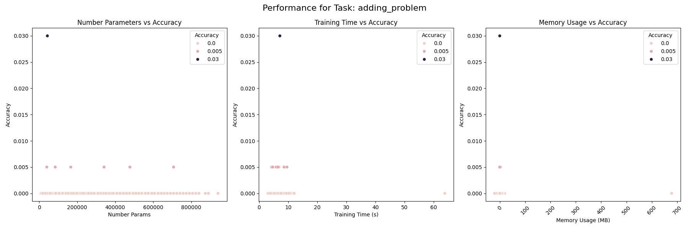

## Task: bracket_matching
#### Results
- Accuracy: 0.5700
- Precision: 0.3249
- Recall: 0.5700
- Training Time: 3.3003 seconds
- Inference Time: 2.3633 seconds
- Memory Usage: 0.0000 MB
- Number Params: 11137

#### Task Parameters
{'n_samples': 1000, 'sequence_length': 200, 'max_depth': 20}

#### Model Parameters
{'d_model': np.int64(16), 'nhead': np.int64(2), 'num_encoder_layers': 2, 'num_decoder_layers': 1, 'dim_feedforward': np.int64(64), 'dropout': 0.1, 'learning_rate': 0.001, 'device': 'cuda'}

#### Training Parameters
{'epochs': 10, 'batch_size': 10}

#### Performance Plot
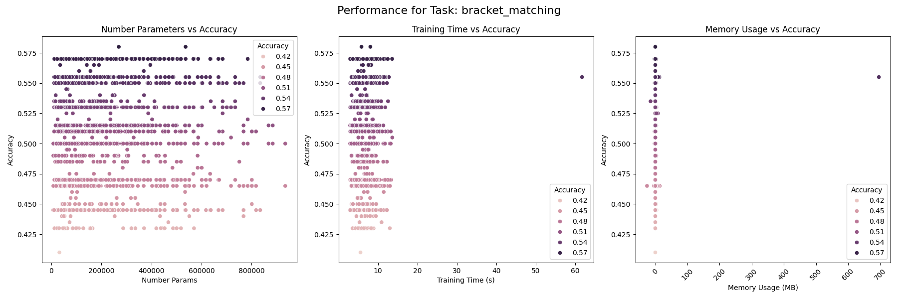

## Task: chaotic_forecasting
#### Results
- MSE: 0.1287
- Training Time: 0.0676 seconds
- Inference Time: 0.2394 seconds
- Memory Usage: 0.0000 MB
- Number Params: 12147

#### Task Parameters
{'sequence_length': 1000, 'forecast_length': 10}

#### Model Parameters
{'d_model': np.int64(16), 'nhead': np.int64(4), 'num_encoder_layers': 1, 'num_decoder_layers': 1, 'dim_feedforward': np.int64(128), 'dropout': 0.1, 'learning_rate': 0.001, 'device': 'cuda'}

#### Training Parameters
{'epochs': 10, 'batch_size': 10}

#### Performance Plot
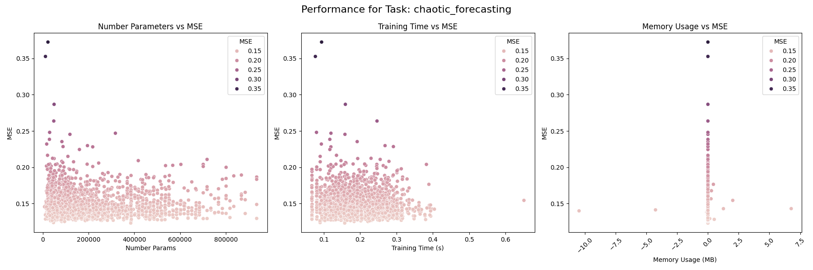

## Task: continue_pattern_completion
#### Results
- MSE: 0.0853
- Training Time: 8.4061 seconds
- Inference Time: 5.0397 seconds
- Memory Usage: 0.0000 MB
- Number Params: 51745

#### Task Parameters
{'n_samples': 1000, 'sequence_length': 100, 'base_length': 10, 'mask_ratio': 0.2}

#### Model Parameters
{'d_model': np.int64(16), 'nhead': np.int64(4), 'num_encoder_layers': 5, 'num_decoder_layers': 8, 'dim_feedforward': np.int64(64), 'dropout': 0.1, 'learning_rate': 0.001, 'device': 'cuda'}

#### Training Parameters
{'epochs': 10, 'batch_size': 10}

#### Performance Plot
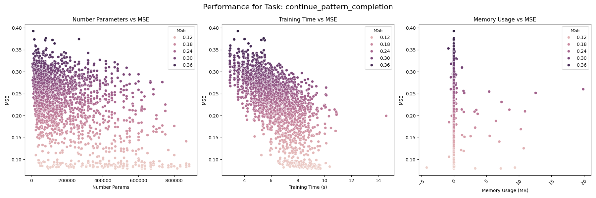

## Task: continue_postcasting
#### Results
- MSE: 0.2002
- Training Time: 0.0810 seconds
- Inference Time: 0.3001 seconds
- Memory Usage: 0.0000 MB
- Number Params: 11105

#### Task Parameters
{'sequence_length': 1000, 'delay': 10}

#### Model Parameters
{'d_model': np.int64(16), 'nhead': np.int64(2), 'num_encoder_layers': 2, 'num_decoder_layers': 1, 'dim_feedforward': np.int64(64), 'dropout': 0.1, 'learning_rate': 0.001, 'device': 'cuda'}

#### Training Parameters
{'epochs': 10, 'batch_size': 10}

#### Performance Plot
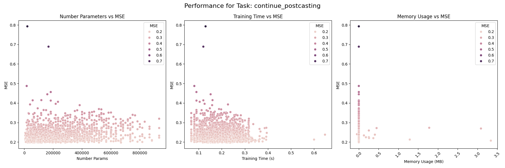

## Task: copy_task
#### Results
- Accuracy: 0.0286
- Precision: 0.0697
- Recall: 0.1871
- Training Time: 2.9500 seconds
- Inference Time: 1.0363 seconds
- Memory Usage: 0.0000 MB
- Number Params: 12506

#### Task Parameters
{'n_samples': 1000, 'sequence_length': 50, 'delay': 10, 'n_symbols': 10}

#### Model Parameters
{'d_model': np.int64(16), 'nhead': np.int64(2), 'num_encoder_layers': 1, 'num_decoder_layers': 1, 'dim_feedforward': np.int64(128), 'dropout': 0.1, 'learning_rate': 0.001, 'device': 'cuda'}

#### Training Parameters
{'epochs': 10, 'batch_size': 10}

#### Performance Plot
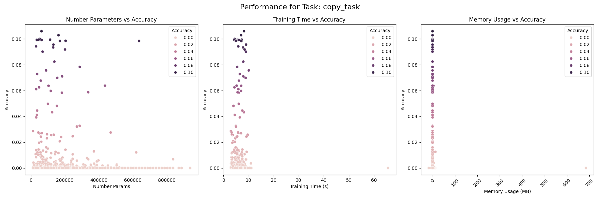

## Task: discrete_pattern_completion
#### Results
- Accuracy: 0.0215
- Precision: 0.0695
- Recall: 0.1910
- Training Time: 2.9570 seconds
- Inference Time: 0.9512 seconds
- Memory Usage: 0.0000 MB
- Number Params: 12604

#### Task Parameters
{'n_samples': 1000, 'sequence_length': 100, 'n_symbols': 12, 'base_length': 20, 'mask_ratio': 0.2}

#### Model Parameters
{'d_model': np.int64(16), 'nhead': np.int64(2), 'num_encoder_layers': 1, 'num_decoder_layers': 1, 'dim_feedforward': np.int64(128), 'dropout': 0.1, 'learning_rate': 0.001, 'device': 'cuda'}

#### Training Parameters
{'epochs': 10, 'batch_size': 10}

#### Performance Plot
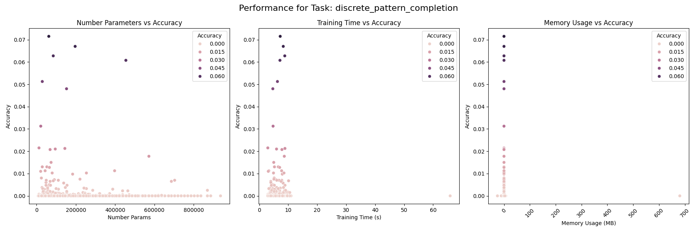

## Task: discrete_postcasting
#### Results
- Accuracy: 0.0000
- Precision: 0.0027
- Recall: 0.1000
- Training Time: 0.0679 seconds
- Inference Time: 0.2401 seconds
- Memory Usage: 0.0000 MB
- Number Params: 9246

#### Task Parameters
{'sequence_length': 1000, 'delay': 10, 'n_symbols': 30}

#### Model Parameters
{'d_model': np.int64(16), 'nhead': np.int64(4), 'num_encoder_layers': 1, 'num_decoder_layers': 1, 'dim_feedforward': np.int64(64), 'dropout': 0.1, 'learning_rate': 0.001, 'device': 'cuda'}

#### Training Parameters
{'epochs': 10, 'batch_size': 10}

#### Performance Plot
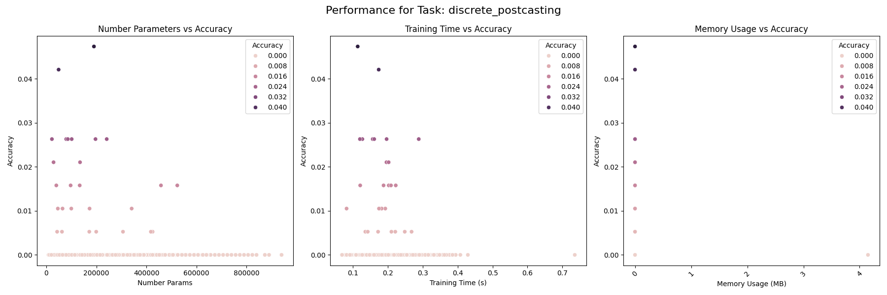

## Task: mnist_classification
#### Results
- Accuracy: 0.1300
- Precision: 0.0189
- Recall: 0.1300
- Training Time: 2.9241 seconds
- Inference Time: 0.2832 seconds
- Memory Usage: 0.0000 MB
- Number Params: 8570

#### Task Parameters
{'n_samples': 1000, 'path': 'datasets/mnist'}

#### Model Parameters
{'d_model': np.int64(16), 'nhead': np.int64(2), 'num_encoder_layers': 1, 'num_decoder_layers': 1, 'dim_feedforward': np.int64(64), 'dropout': 0.1, 'learning_rate': 0.001, 'device': 'cuda'}

#### Training Parameters
{'epochs': 10, 'batch_size': 10}

#### Performance Plot
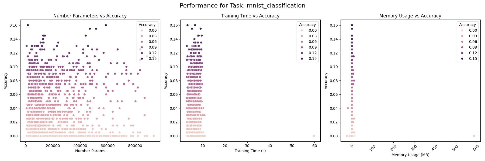

## Task: selective_copy_task
#### Results
- Accuracy: 0.0932
- Precision: 0.0186
- Recall: 0.1050
- Training Time: 2.9841 seconds
- Inference Time: 1.2590 seconds
- Memory Usage: 0.0000 MB
- Number Params: 8298

#### Task Parameters
{'n_samples': 1000, 'sequence_length': 100, 'delay': 10, 'n_markers': 20, 'n_symbols': 10}

#### Model Parameters
{'d_model': np.int64(16), 'nhead': np.int64(2), 'num_encoder_layers': 1, 'num_decoder_layers': 1, 'dim_feedforward': np.int64(64), 'dropout': 0.1, 'learning_rate': 0.001, 'device': 'cuda'}

#### Training Parameters
{'epochs': 10, 'batch_size': 10}

#### Performance Plot
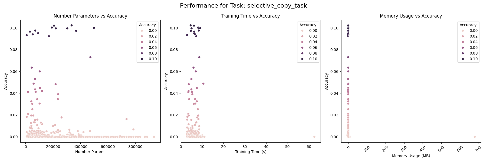

## Task: sin_forecasting
#### Results
- MSE: 0.4928
- Training Time: 0.1130 seconds
- Inference Time: 0.4745 seconds
- Memory Usage: 0.0000 MB
- Number Params: 16625

#### Task Parameters
{'sequence_length': 1000, 'forecast_length': 10}

#### Model Parameters
{'d_model': np.int64(16), 'nhead': np.int64(2), 'num_encoder_layers': 1, 'num_decoder_layers': 3, 'dim_feedforward': np.int64(64), 'dropout': 0.1, 'learning_rate': 0.001, 'device': 'cuda'}

#### Training Parameters
{'epochs': 10, 'batch_size': 10}

#### Performance Plot
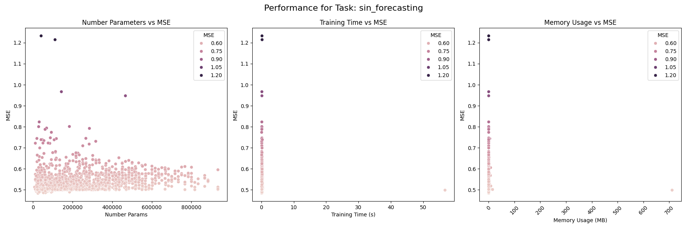

## Task: sorting_problem
#### Results
- Accuracy: 0.0749
- Precision: 0.0590
- Recall: 0.0828
- Training Time: 6.2139 seconds
- Inference Time: 3.5582 seconds
- Memory Usage: 0.0000 MB
- Number Params: 28842

#### Task Parameters
{'n_samples': 1000, 'sequence_length': 50, 'n_symbols': 10}

#### Model Parameters
{'d_model': np.int64(16), 'nhead': np.int64(8), 'num_encoder_layers': 3, 'num_decoder_layers': 4, 'dim_feedforward': np.int64(64), 'dropout': 0.1, 'learning_rate': 0.001, 'device': 'cuda'}

#### Training Parameters
{'epochs': 10, 'batch_size': 10}

#### Performance Plot
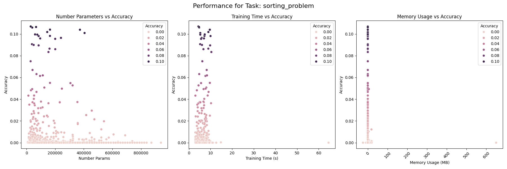

