# Sequential Tasks Review to Evaluate Artificial Memory 

The ability to maintain and manipulate information over time is a key aspect of Artificial Intelligence. Sequential models, such as Recurrent Neural Networks (RNNs) and Transformers [REF], have been widely used for tasks requiring working memory, such as natural language processing and time series prediction. However, evaluating the capacity of these models to maintain and manipulate information over long periods remains a challenge. Existing methods often focus on one or two specific tasks (e.g. SequentialMNIST [REF], copy task [REF], etc.), which may not be representative of the model's generalization capabilities.

In this paper, we propose a new benchmark called STREAM (Sequential Tasks Review to Evaluate Artificial Memory) that aims to address this limitation by providing a diverse set of 12 tasks that test different aspects of working memory. By providing a standardized framework for evaluation, STREAM allows researchers to easily compare the performance of different model architectures.

In addition, we evaluate the performance of four different model architectures on the STREAM benchmark to serve as a baseline: Long Short-Term Memory (LSTM) [REF], Transformers [REF], Transformer-Decoder [REF], and Echo State Networks (ESN) [REF]. We compare the models' performance on each task and analyze their strengths and weaknesses.

## Introduction

Since the release of Transformers [REF] in 2017, no major breakthrought has been made in the field of neural networks architectures for Sequential Tasks. Even though Transformers have been proven to be very efficient for a wide range of tasks, they are not perfect and suffers from some limitations. For instance, Transformers aren't RNNs : they do not rely on previous internal state to compute the next one, they need to look at the whole input sequence to compute the next word at each timestep, and the number of computation grows quadratically with the length of the sequence. Which is a major limitation for long sequences and long-term dependencies.

For those reasons, we believe that the next step in Artificial Intelligence won't be made with current architectures like Transformers, but with new ones that might be inspired by existing architectures like LSTMs [REF] or ESNs [REF] or by our brain.

But, such models often needs to be scaled to be efficiant on complex problems (e.g. Natural Language Processing) and to be able to generalize on a wide range of tasks. And, it is not always easy to train and evaluate those scaled models : ressources like GPUs are expensives. Except from big private compagnies, only a fiew of research labs can afford to train and evaluate those models on a large scale (e.g. on text). 

Further, the path to find a valuable architecture is not always clear and can lead to a lot of failure. Whoever will try to find a new architecture will have to train and evaluate countless of models before finding a good one. And finally, even with a good architecture, there can be a lot of different variation from a unique model (e.g. hyperparameters, initialization, etc.) that can lead to very different results. 

For all those reasons, we believe that their is a need for a benchmark to evaluate an architecture on different abilities and at a lower scale than text generation. So that researchers can easily compare their new architectures to existing ones on different criteria.

We tried to tackle this problem by providing a set of 12 small but complex sequential tasks so one can train, evaluate and compare its new archiectures to existing ones without the need to scale them first. Each task is designed to be adjustable in difficulty and complexity, so that we can create different level of difficulty for the benchmark.

## Tasks

In this section, we will present each of the tasks we implemented for the Benchmark. Those tasks have been sort in 4 categories : Simple Memory, Signal Processing, Long-Term Dependencies and Information Manipulation.

### Simple Memory

#### Discrete Postcasting

This task tests the model's ability to maintain and reproduce discrete information after a specific delay. The input consists of one-hot encoded symbols from a finite set (n_symbols). After receiving a symbol, the model must reproduce it exactly after a fixed delay of d timesteps. This evaluates the model's capacity to maintain precise symbolic information in its memory without degradation, even in the presence of ongoing input processing.

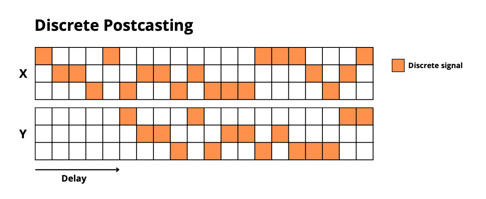

#### Continue Postcasting

Similar to discrete postcasting, but with continuous values instead of discrete symbols. The model receives real-valued inputs in the range [-0.8, 0.8] and must reproduce each value after a fixed delay. This tests the model's ability to maintain precise numerical information in memory, which is more challenging than discrete values as it requires preserving exact quantities rather than just categories.

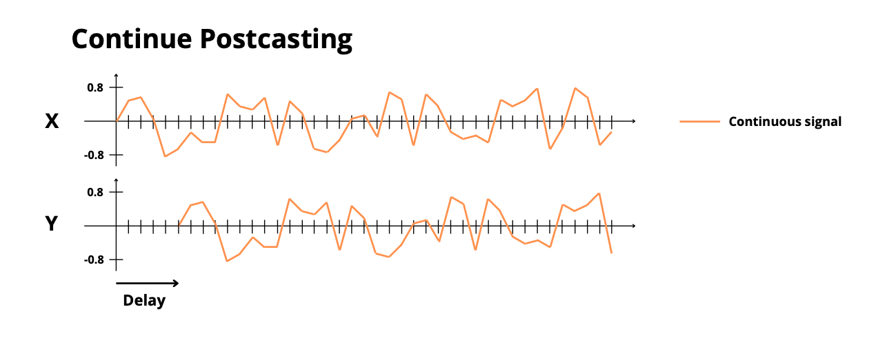

### Signal Processing

#### Sin Forecasting

This task evaluates the model's ability to predict future values of a frequency-modulated sinusoidal signal. The input signal combines a carrier wave (frequency = 10Hz) modulated by a slower sinusoidal wave (frequency = 0.5Hz). The model must predict the signal's value in N timesteps, requiring it to understand both the fast oscillations of the carrier wave and the slower modulation pattern. This tests the model's capability to process hierarchical temporal patterns at different timescales.

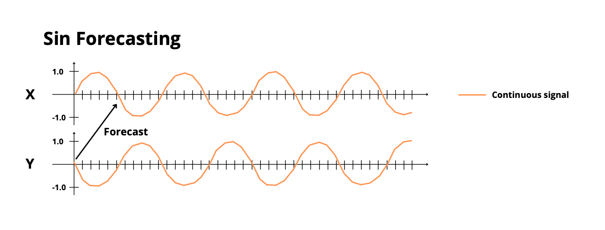

#### Chaotic Forecasting

This task uses the Lorenz system, a classic example of deterministic chaos, to test the model's ability to predict complex dynamical systems. The input consists of three normalized dimensions (x, y, z) from the Lorenz attractor, and the model must predict the system's state in N timesteps. This tests the model's capacity to learn and predict non-linear dynamics, where small prediction errors can lead to significantly different trajectories over time.

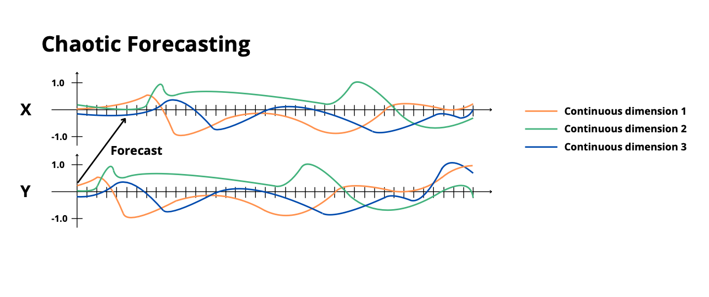

### Long-Term Dependencies

#### Discrete Pattern Completion

The model must identify and complete repetitive patterns in a sequence of discrete symbols. The sequence consists of a base pattern of length n that repeats throughout the sequence. Some symbols are masked, and the model must predict these masked values based on the pattern it has learned. A marker indicates when predictions are required. This tests the model's ability to discover and utilize regular patterns in sequences, even when they are partially obscured.

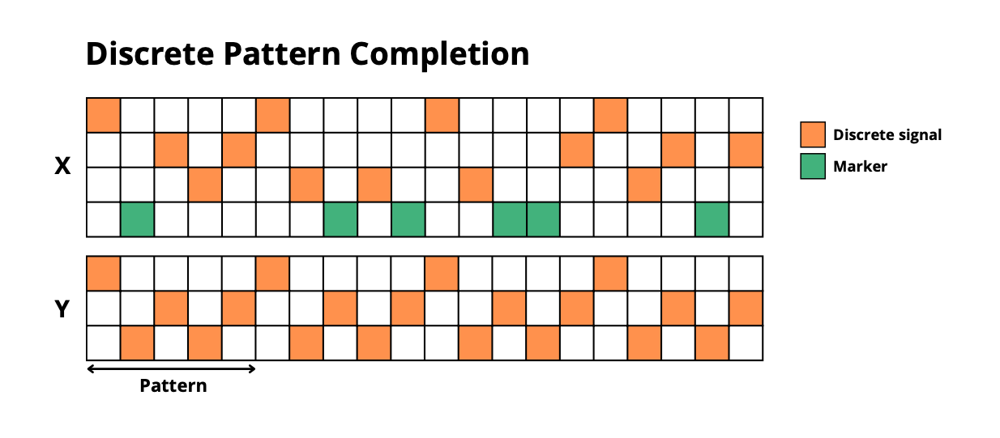

#### Continue Pattern Completion

Similar to discrete pattern completion but with continuous values. The model must identify and complete repetitive patterns in a sequence of real values. Masked values are indicated by -1, and the model must predict these values based on the learned pattern. This tests pattern recognition capabilities with continuous data, which is more challenging as it requires precise numerical predictions rather than classification.

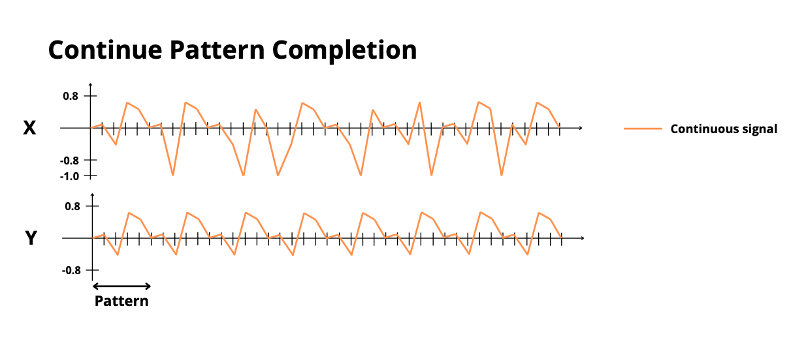

#### Copy Task

The model must memorize a whole sequence of discrete symbols, maintain this information during a delay period, and then reproduce the entire sequence when triggered. The task tests pure memorization capacity, as the model must store the complete sequence without any compression or pattern recognition. The trigger signal tests the model's ability to maintain information in memory until it's needed.

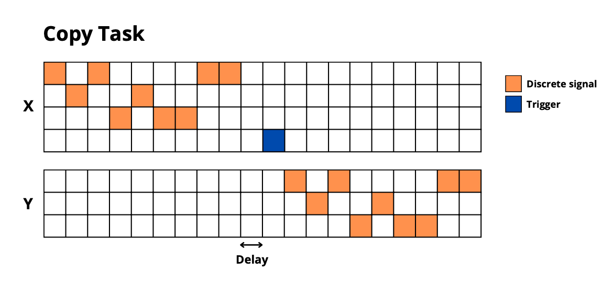

#### Selective Copy

A variation of the copy task where only specific marked elements need to be memorized and reproduced. The model receives a sequence where certain elements are marked for memorization. After a delay, when triggered, it must reproduce only the marked elements in their original order. This tests the model's ability to selectively attend to and store specific information while ignoring irrelevant inputs.

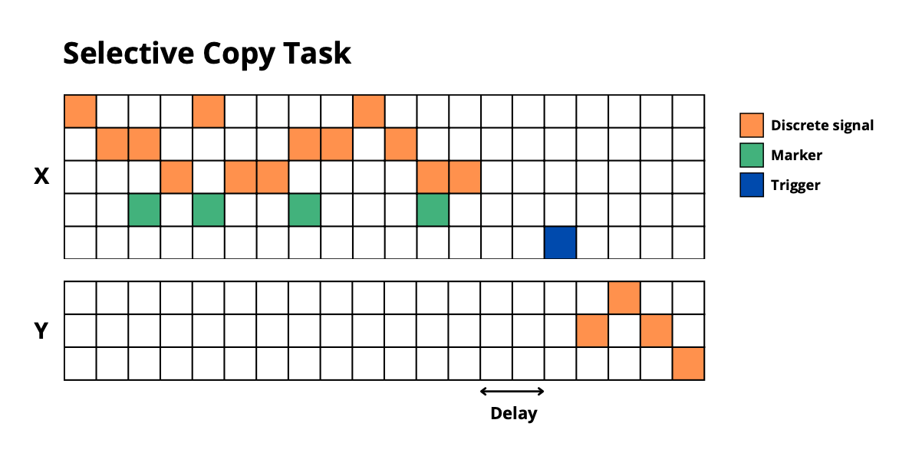

### Information Manipulation

#### Adding Problem

The model must process a sequence of random numbers, with certain positions marked. When triggered, it must sum the numbers at the marked positions. This tests the model's ability to not just store information but also perform arithmetic operations on stored values. It combines selective attention (identifying marked positions), memory (storing the values), and computation (adding the values).

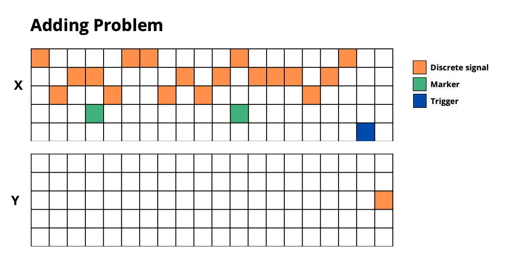

#### Sorting Problem

Each input combines a symbol with a position indicator. The model must memorize these symbol-position pairs and, when triggered, output the symbols in the correct order according to their associated positions. This tests the model's ability to maintain associations between different types of information (symbols and positions) and perform complex reordering operations on stored information.

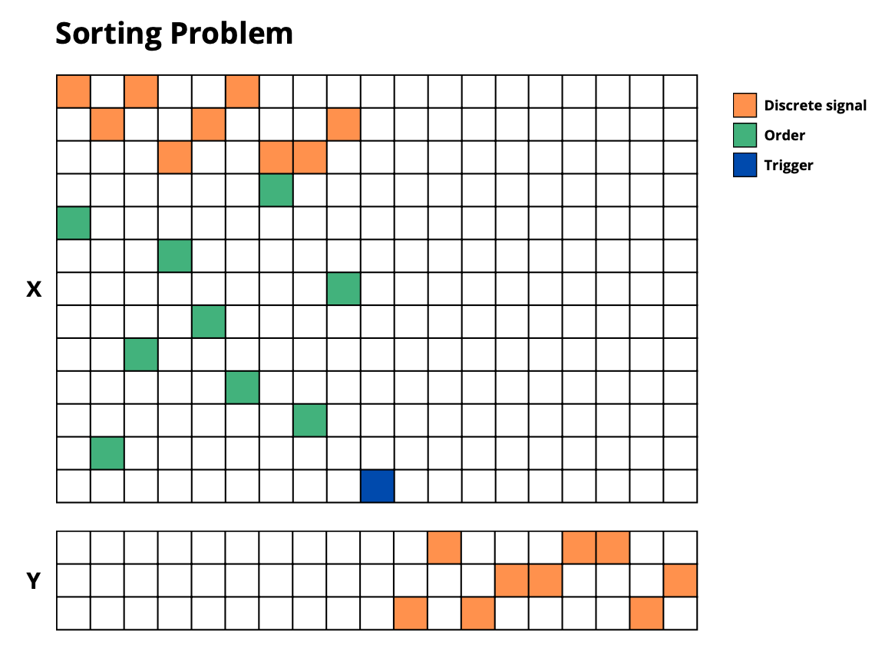

#### MNIST Classification

A sequential version of the MNIST digit classification task. The model receives normalized pixel values column by column, must build and maintain an internal representation of the complete image, and then classify the digit when triggered. This tests the model's ability to construct and maintain complex spatial representations from sequential input and use this information for classification.

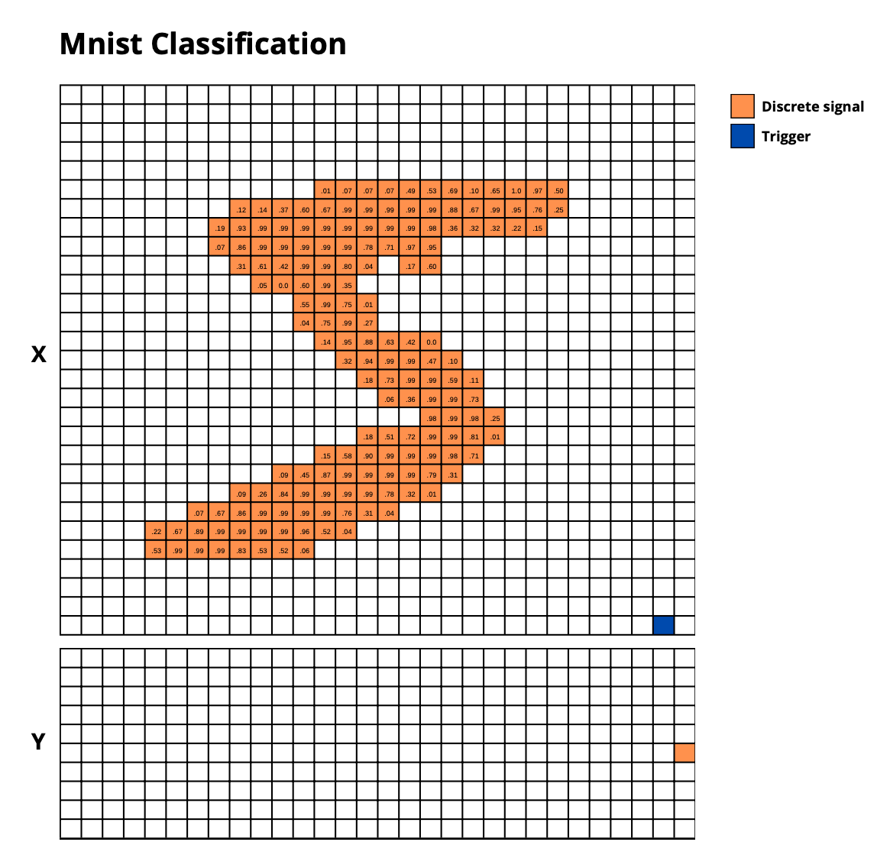

#### Bracket Matching

The model must validate sequences of nested parentheses. Each sequence can have multiple levels of nesting (up to max_depth), and the model must determine whether the sequence is valid (i.e., all brackets are properly closed in the correct order). This tests the model's ability to maintain hierarchical context information and track nested dependencies, which is crucial for tasks like parsing formal languages or understanding hierarchical structures in natural language.

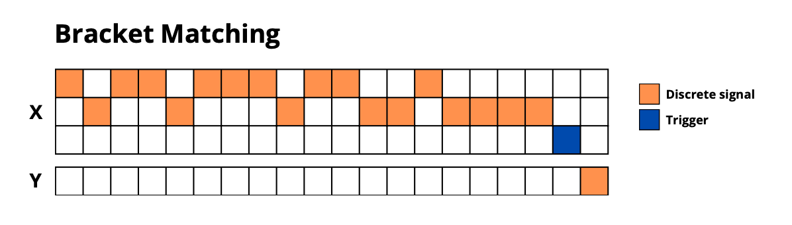

## Evaluated Models : Baseline

### ESN

The Echo State Network (ESN) [REF] represents a fascinating approach to temporal processing, implementing the Reservoir Computing methodology. At its heart lies the reservoir, a recurrent neural network featuring fixed, randomly initialized weights. The reservoir's behavior is governed by two crucial parameters: the spectral radius, which maintains the stability of the reservoir's weight matrix while determining its temporal memory capacity, and the leak rate, which controls how quickly the network "forgets" previous information. The reservoir's dimension, specified by n_units, determines the network's capacity to represent complex temporal patterns. The readout - a simple linear layer implementing Ridge regression - maps the rich dynamics of the reservoir states to desired outputs. This combination of a dynamic reservoir and a simple readout mechanism makes the ESN particularly efficient for capturing complex temporal dependencies.

### LSTM

The Long Short-Term Memory (LSTM) [REF] network implements a deep sequential processing approach. The architecture begins with an input projection layer that adapts the input to the LSTM's hidden dimension, automatically inferring the appropriate dimensionality during training. The core of the network consists of multiple stacked LSTM layers, with the number of layers controlled by the num_layers parameter. Each LSTM layer maintains its own set of weight matrices and states, consisting of both a hidden state and a cell state. This hierarchical structure enables the network to learn increasingly abstract temporal features at each level. The final layer projects the LSTM's hidden state to the output dimension, again with automatic dimension adaptation. This architecture excels at capturing long-term dependencies in sequential data, thanks to its sophisticated gating mechanisms and deep structure.

### Transformers

The full Transformer [REF] architecture represents a significant departure from traditional sequential processing, implementing a parallel processing approach through attention mechanisms. The encoder component comprises multiple layers, each featuring a self-attention mechanism that models relationships between sequence elements, complemented by position-wise feed-forward networks. The decoder similarly consists of multiple layers, but with an additional cross-attention mechanism that enables it to relate the output sequence to the input sequence. Both encoder and decoder feature dedicated input processing layers that project their inputs to the model's working dimension (d_model). The output processing occurs through a final linear projection layer. This architecture's strength lies in its ability to process entire sequences in parallel while maintaining unlimited theoretical access to any part of the input sequence.

### Transformer Decoder

The Transformer Decoder [REF] presents a streamlined variant of the full Transformer, optimized for sequence prediction tasks. It maintains the core strengths of the Transformer architecture while reducing computational overhead. The architecture begins with a single input projection layer that maps inputs to the model's working dimension. This is followed by a stack of decoder layers, each implementing self-attention mechanisms and feed-forward networks. The final output layer projects the decoder states to the desired output dimension. This architecture proves particularly effective for tasks where the full encoder-decoder structure might be unnecessary.

## Experimental Results

We conducted experiments on the STREAM benchmark using the four architectures we described above: ESN, LSTM, Transformers, and Transformer-Decoder. Each tasks difficulty can be adjust by changing the number of symbols, the length of the sequences, the delay, etc. All thoses task parameters have been selected so that the benchmark can be runned on a cluster of 8xA100 GPUs in less than 20 hours by architecture. Those task parameters are described in the annexes [ANNEXE].

We didn't know the best Hyper-Parameters (HP) for each architecture on each task, so we used a random search to find the best ones. For each task and each architecture, we sampled 2000 sets of HP on 10 seeds (200 per seed) and trained a model for each set of HP. The HP space search for each architecture is described in the annexes [ANNEXE]. 

We evaluated the performance of each trained models on its test set and reported its error (Mean Square Error for regression tasks and 1-Accuracy for classification tasks). Then, for each architecture and each tasks, we seperate the models in 5 categories : models having less than 1k parameters, 10k parameters, 100k parameters, 1M parameters, and more than 1M parameters. We retrieved the best model in each category, here are the results :

TABLE

## Discussion

SOME PLOTS + DISCUSSION

## Conclusion

We propose STREAM, a new benchmark that aims to evaluate the capacity of sequential models to maintain and manipulate information over time. The benchmark consists of 12 diverse tasks that test different aspects of working memory, including simple memory, signal processing, long-term dependencies, and information manipulation. We evaluated four different model architectures on the STREAM benchmark: ESN, LSTM, Transformers, and Transformer-Decoder. Our results show that each architecture has its strengths and weaknesses across different tasks, highlighting the importance of task-specific evaluation for sequential models. We hope that the STREAM benchmark will serve as a valuable resource for researchers working on sequential tasks and help drive progress in the field of artificial memory.

## Annexes

Plots of the results : comparison of performance of each architecture on each task, comparison of performance of each architecture on each category of number of parameters.

## References
Transformers
LSTM
ESN
https://www.youtube.com/watch?v=5t1vTLU7s40

## Acknowledgements
JeanZay et Plafrim